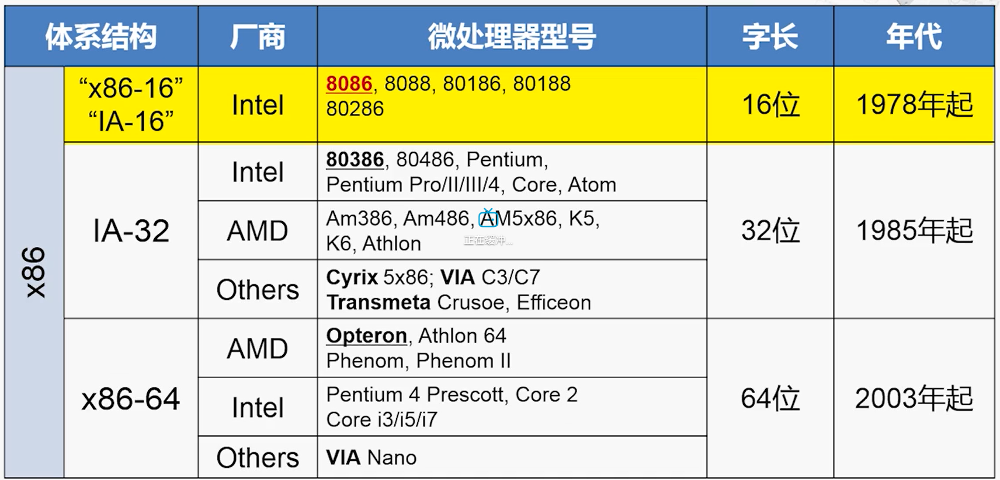
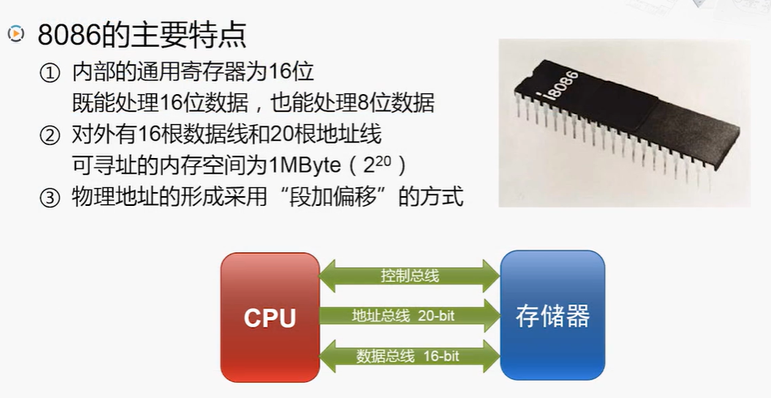
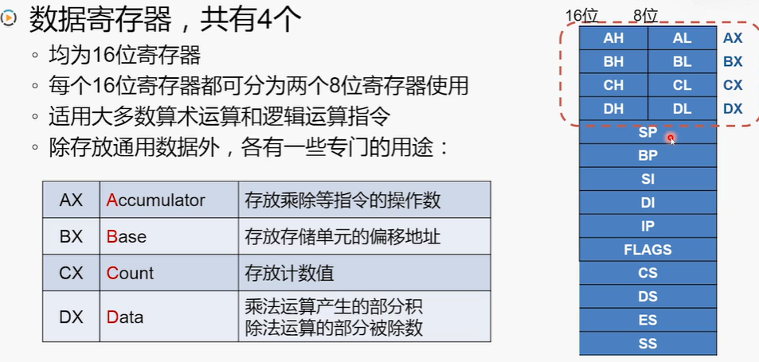
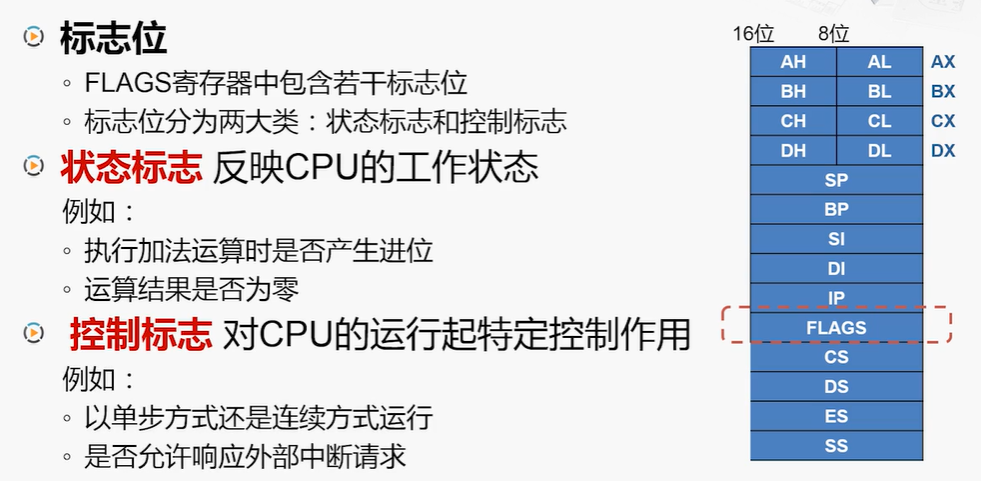
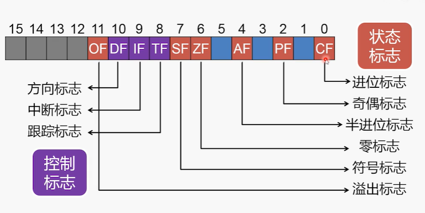
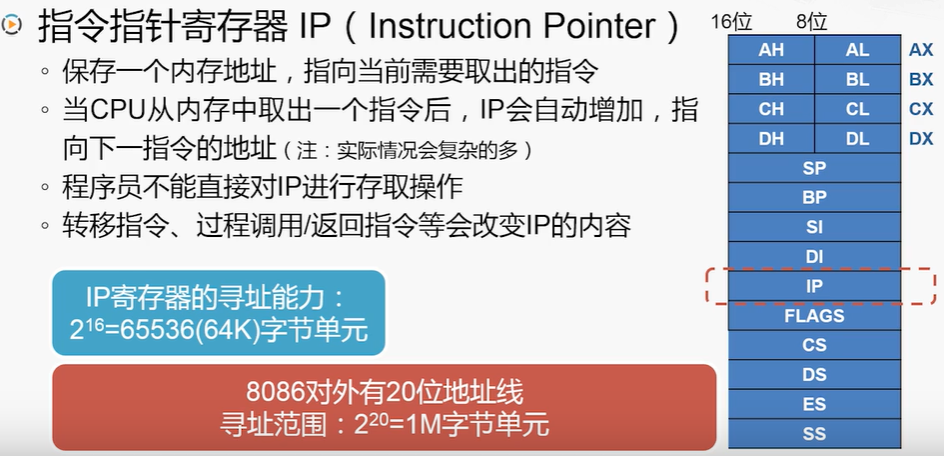
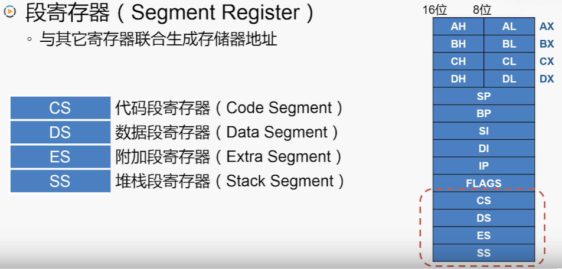
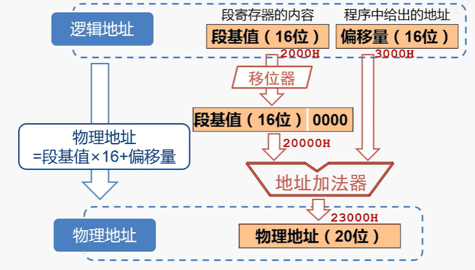
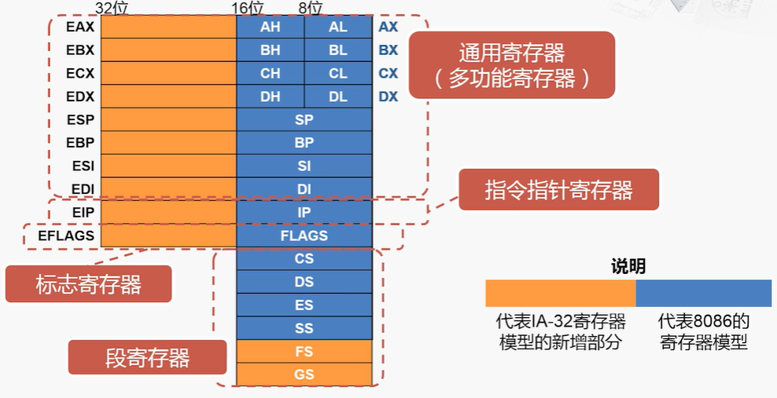
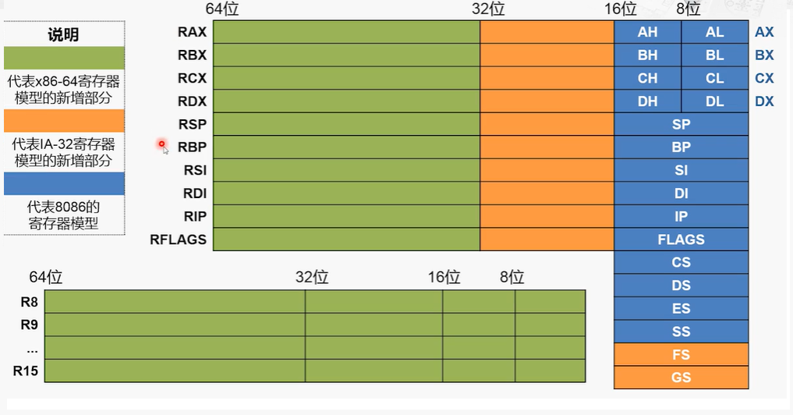

# x86体系结构概述    

### x86结构中具有代表性的一些处理器：    

    

## 1、Intel 8086处理器    

- 8086处理器主要特点：    

    

> 通用寄存器的位宽通常和运算单元位宽相同。    
> 地址总线是20位的，生成访问存储器的地址，需要采用特殊的方式。    

- 8086通用寄存器：    

    

- 8086标志寄存器：    

    
    

> 标志寄存器中只有一部分位是有意义的。    

- 8086 IP寄存器：    

   

- 8086 段寄存器：    

段寄存器作用-与其他寄存器联合生产存储器地址：    
  

物理地址生成：    
  

> Baike：段寄存器是因为对内存的分段管理而设置的。计算机需要对内存分段，以分配给不同的程序使用（类似于硬盘分页）。    
> Baike：在描述内存分段时，需要有如下段的信息：1.段的大小；2.段的起始地址；3.段的管理属性（禁止写入/禁止执行/系统专用等）。需要用8个字节（64位）存储这些信息，但段寄存器只有16位，因此段寄存器中只能存储段号（segment selector，也译作“段选择符”），再由段号映射到存在内存中的GDT（global (segment) descriptor table，全局段号记录表），读取段的信息。    

 
 

## 2、Intel80386处理器    

- Intel80386：    

Intel80386处理器是80x86系列中第一款32位微处理器。    

支持32位的算术和逻辑运算，提供32位的微处理器。    

地址总线可扩展到32位，可寻址4GB的内存空间。    

改进了保护模式（例如段范围可达4GB）。增加了“虚拟8086模式”，可以同时模拟多个8086微处理器。    

- IA-32的寄存器模型：        

  

> 不仅保留了段寄存器，还增加了两个段寄存器。    
> 在“保护模式”下，段寄存器的使用方法是不一样的。    

 
 

## 3、x86-64架构的处理器    

- IA-64的寄存器模型：    

  

（END）    

