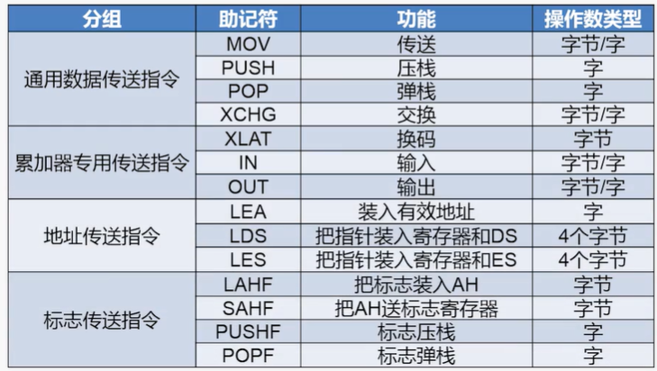
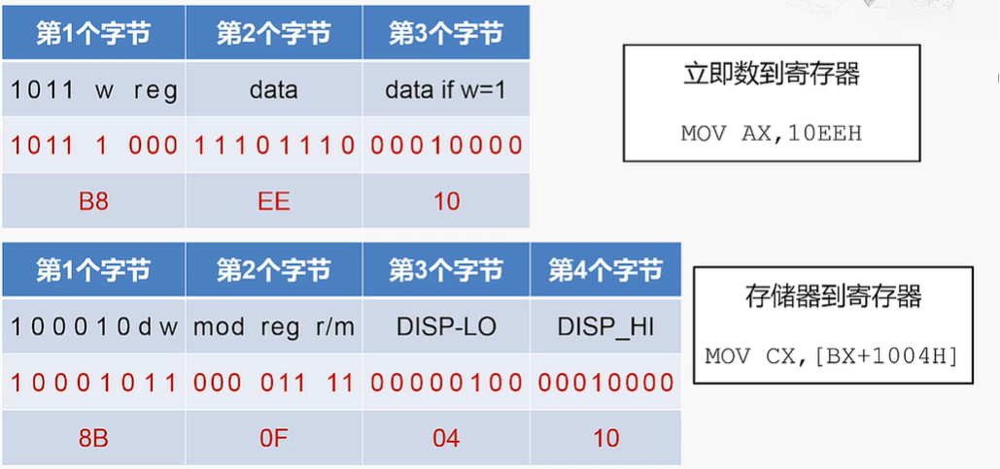
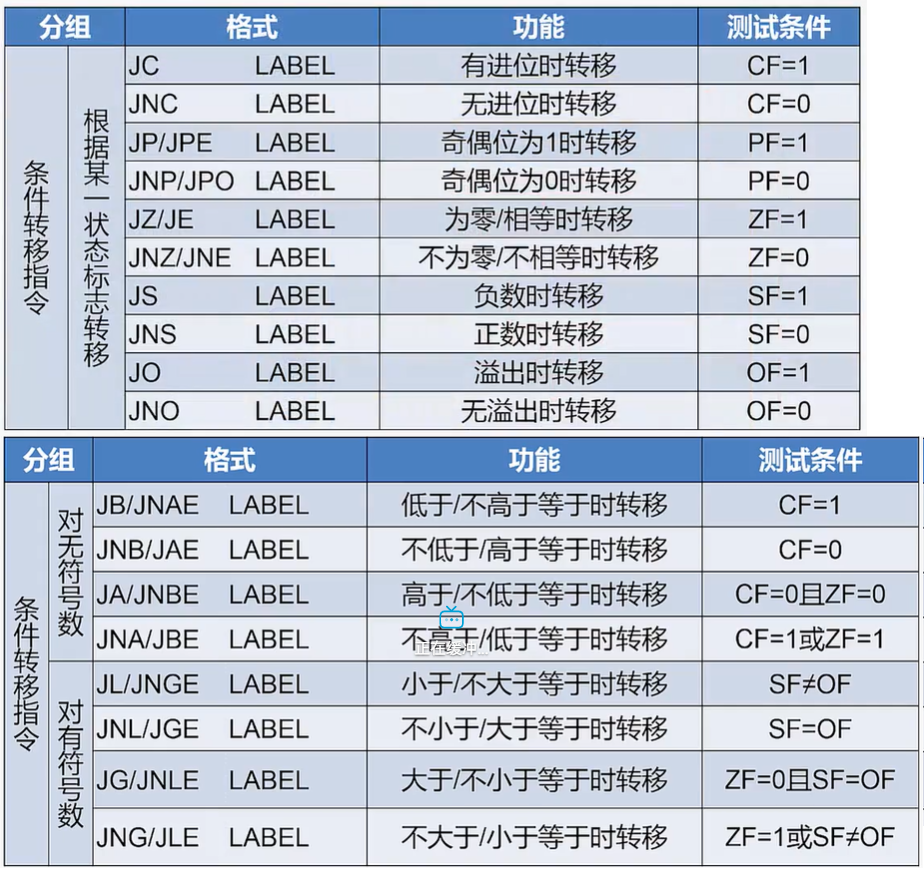
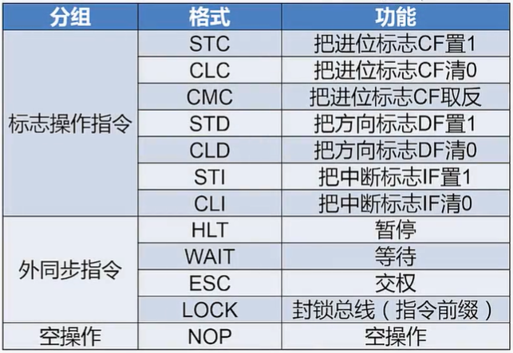
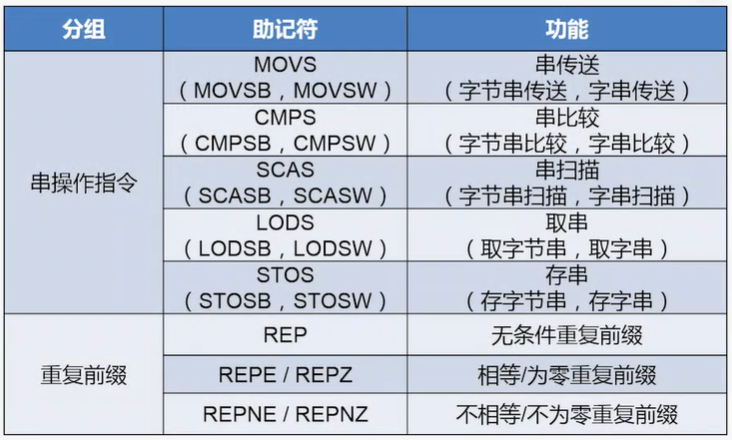

# x86指令    

> x86是一种复杂指令集(CISC)。      
> x86使用变长度指令，即指令的长度不是固定的。    


<br />
<br />

## 1、传送类指令    

    

#### 示例：MOV指令：    

- 格式：  
```
MOV DST, SRC    
```    
- 操作：  
将源操作数传送到目的操作数中。源操作数保持不变。      

- 示例：    
```
MOV EBX, 40    //将操作数40传送带EBX寄存器中。    
//（直接给出操作数）（操作数的值体现在指令编码中）    

MOV AL, BL    //BL寄存器的内存传送到AL寄存器中    
//（给出存放操作数的寄存器名称）    

MOV ECX, [1000H]    //将1000H指向的存储器单元的内容取传送到ECX寄存器中    
//（给出存放操作数的存储器地址）    

MOV [DI], AX      //将AX寄存器的内容传送到某个存储器单元（存储器单元的地址存储在DI寄存器中）  
//（给出存放“存放操作数的存储器地址”的寄存器名称）   

MOV WORD PTR[BX+SI*2+200H], 01H      
//（给出“存放操作数的存储器地址”的计算方法）      
```  

- 编码：    

    


<br />
<br />

## 2、运算类指令    

    


#### 示例：ADD指令(加)：    

- 格式：    
```
ADD DST, SRC    
```

- 操作：    
将两个操作数相加并把结果存放到第一个操作数(DST)当中去。    

- 注意：    
ADD指令会改变CF标志位。    

#### 示例：INC指令(加一)：    

- 格式：    
```
INC OPR
```

- 操作：    
将操作数(OPR)加一。    

- 注意：    
INC指令编码很短，只需要一个字节。  
INC指令不会改变CF标志位。（DEC指令也不会）    

#### 示例：ADC指令(带进位的加)：    

- 格式：    
```
ADC DST, SRC    
```

- 操作：    
DST <- DST + SRC + CF  
两个操作数相加，再加上CF标志位，结果存放到第一个(DST)操作数中去。    

- 注意：    
ADC指令同样也会改变CF标志位。    


<br />
<br />

## 3、转移类指令    

    

#### 示例：JNZ指令：    

- 格式：    
```
JNZ LABEL    
```
- 操作：    
无进位时(CF=0)转移到标签位置。    


<br />
<br />

## 4、控制类指令      

    

> 作用：    
> 1、控制CPU的功能。    
> 2、对标志位进行操作。    


# 复杂的x86指令    

## 1、串操作指令    

    

> 串操作指令作用：    
> 1、对存储器中的数据船进行每次一个元素的操作。      
> 2、串的基本单位是字节或者字(即"一个元素")。    

#### 示例：MOVSB指令和REP指令：    

- MOVSB格式    
```
MOVSB
```
- MOVSB的操作：    
在存储器中将指定位置的一个字节单元传送到另一个指定的位置。    

- REP格式：    
```
REP 串操作指令
```
- REP操作：    
当CX≠0时，重复指向串操作指令。    


- 隐含操作数：  
源串的地址为:DS:SI，目的串的地址为ED:DI    
串的长度在CX寄存器中。    

- 隐含的操作。    
修改SI和DI寄存器，指向下一个串元素。    
若使用重复前缀，则CX <- CX-1。    

- 串传送方向：    
设置DF=0：从源串的低地址开始传送。（传送过程SI和DI自动增量修改）    
设置DF=1：从源串的高地址开始传送。（传送过程SI和DI自动减量修改）    
使用`STD`和`CLD`来设置DF标志位。    


（END）    


