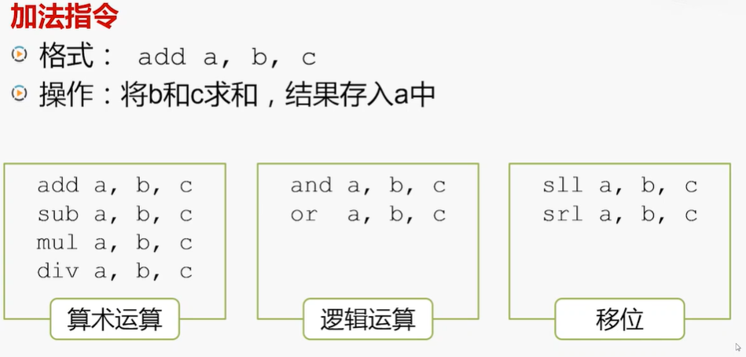
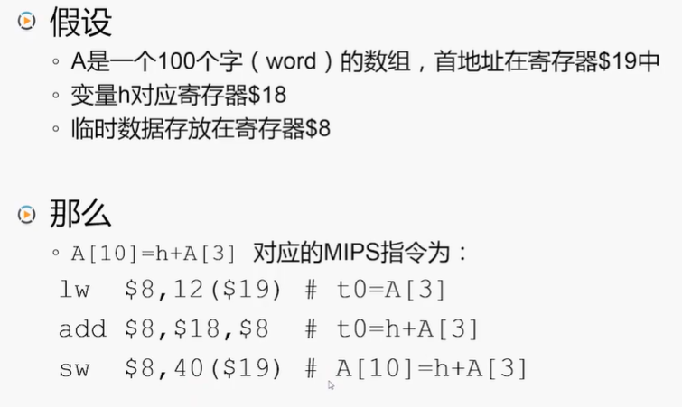
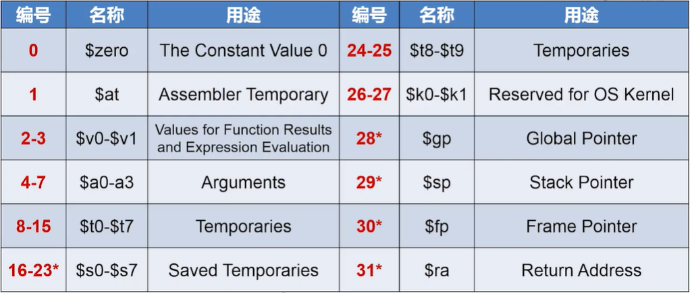

# MIPS指令体系结构    

### RISC和CISC:      

- RISC：    
精简指令系统计算机。    
- CISC：    
复杂指令系统计算机。（代表是x86）    

## 1、MIPS的设计思想和特点      

- MIPS的基本原则：    
A simple CPU is a faster CPU.    

- MIPS的关注点：    

1. 减少指令的类型。  
2. 降低指令的复杂度。    

### 主要特点：    

固定的指令长度。（32bit）    
（简化了从存储器取指令）    

简单的寻址模式。（简单的寻址模式）    
（简化了从存储器去操作数）    

指令数量少，指令功能简单。    

只允许Load和Store指令可以访问存储器。
算术指令不能访问存储器。    
（访存是一个复杂的工作）

直接使用MIPS指令编程变得非常困难。
需要优秀的编译器的支持。    

### 示例-运算指令：    

### 示例-访存指令：    

### MIPS的寄存器：    

（END）    