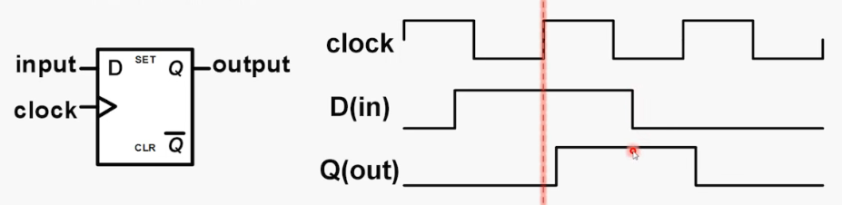
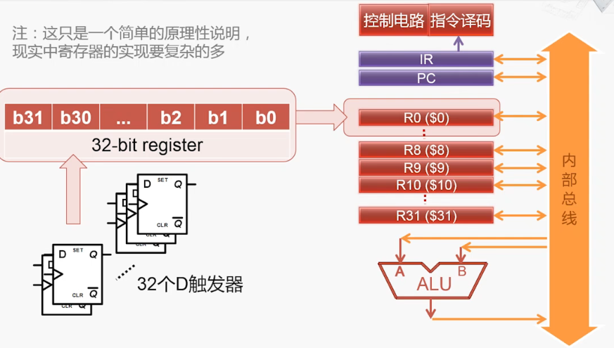

# 寄存器基本原理    

 
 

## 1、D触发器    

  

> D触发器时具有存储信息能力的基本单元。    
> 由若干逻辑门构成，有多种实现方式。    
> 主要有一个数据输入、一个数据输出、一个时钟输入。    
> 在时钟clock的上升沿(0 -> 1)，采样输入D的值，传送到输出Q，其余时间输出Q的值不变。    

 
 

## 2、寄存器组成：    

  

（END）    