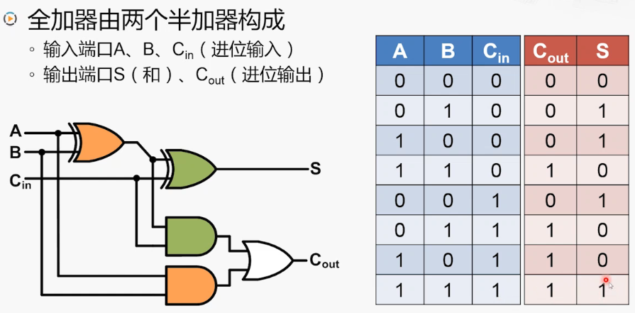

# 加法器    

### 半加器：    

    

### 全加器：    

    

 
 

## 1、加法运算实现    

    

 
 

## 2、加法结果溢出    

### "溢出(overflow)"的含义：    
运算结果超出了正常的表示范围。    

### "溢出"仅针对有符号数运算：    

> CRE：有符号数用补码保存。    

1. 两个正数相加结果为负数。    
2. 两个负数相加结果为正数。    

### "进位"和"溢出"：    
有"溢出"时，不一定有"进位"。    
有"进位"时，不一定有"溢出"。    

 
 

## 3、溢出的检查    

   

- x86对"溢出"的处理方式：    

如果把操作数看作有符号数，运算结果是否发生溢出。若发生溢出，则自动设置溢出标志OF为1，否则OF设置为零。    

 
   

# 减法器    

> 减法运算可以转换为加法运算。    
> 求补码的相反数：**按位取反，末位加一**。    
> 所以在加法器基础上实现减法器：`A + (-B) = A + (~B + 1)`。

 
   

## 1、减法器实现      

   

> 既能实现加法又能实现减法，通过选择信号进行选择。    

 
   

## 加法器优化    

### 行波进位加法器(Ripple-Carry Adder)：    

即上文所用的加法器结构。地位全加器的Cout连接到高位全加器的Cin。    

- 优点：    
电路布局简单，设计方便。    

- 缺点：    
高位的运算必须等待低位运算完成，延迟时间长。    

### 超前进位加法器(Carry-Lookahead Adder)：    

- 提前计算：    

   

- 32位的超前进位加法器原理：    

   

- 32位超前进位加法器：    

> 理想总延迟时间为4级门延迟，远低于行波进位的65级门延迟。    
> 完全的超前进位加法器实际上电路过于复杂，难以实现。    
> 通常使用多个小规模的超前进位加法器，用行波进位方式连接起来。    

（END）    