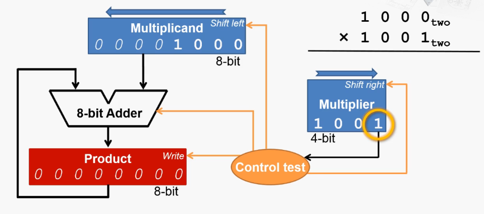
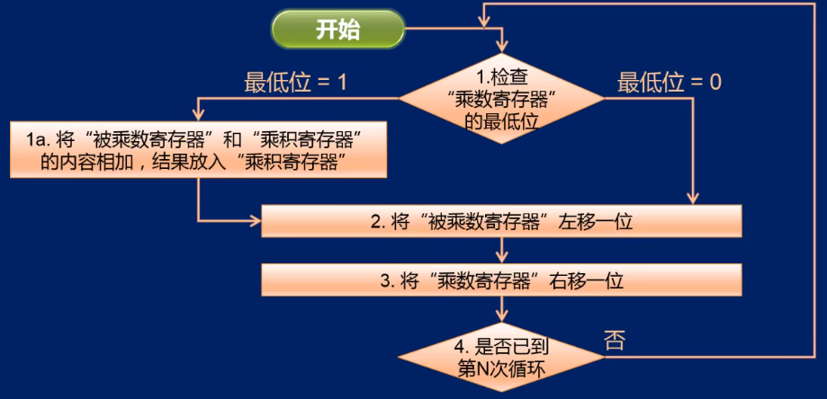
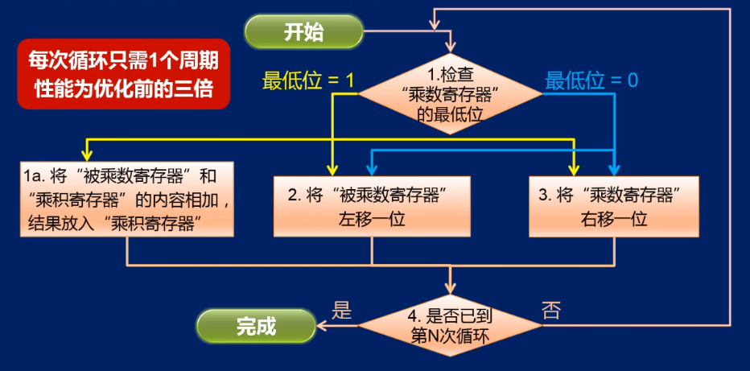
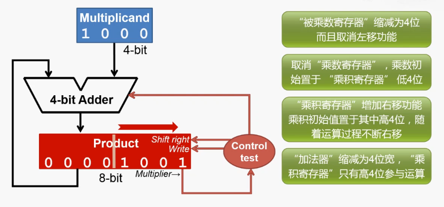

# 乘法器    

> 冯诺依曼关于EDVAC的报告草案：    
> Von：电子管是一种"全或无"设备，适合表示只有两个数值的系统，即二进制。    
> Von：二进制可以大幅简化乘法和除法的运算过程。尤其是对于乘法，不再需要十进制乘法表，也不再需要两轮的加法。      
> 十进制才是适合人类使用的。所以输入输出设备需要承担进制转换工作。    

> Cre：二进制乘法的手算过程比十进制乘法的手算简单很多。并且不需要查乘法表。    
> Cre：十进制的乘法如果用硬件实现应该比较难。      

 
 

## 1、乘法器实现      

    

 
 

## 2、乘法器工作流程    

    

 
   

## 3、乘法器优化1-加法移位并行    

> 原来的乘法器每执行一轮需要3个周期。    
> 可以让加法和移位并行操作。    

    

 
   

## 4、乘法器优化2-减少不必要的硬件      

> 乘积寄存器虽然最后没有位数浪费，但是刚刚开始时有浪费。    
> 乘数寄存器一开始没有浪费，但是在每个周期都会多一个浪费的位数。    
> 被乘数寄存器也有浪费。    

- 优化：    

> 被乘数寄存器取消左移功能，减少位数。    
> 乘积寄存器增加右移功能。    
> 取消乘数寄存器，把乘数和乘积放在一起右移。    

      

(END)    
