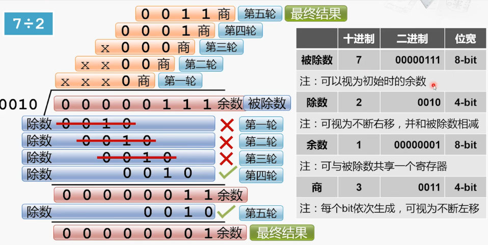
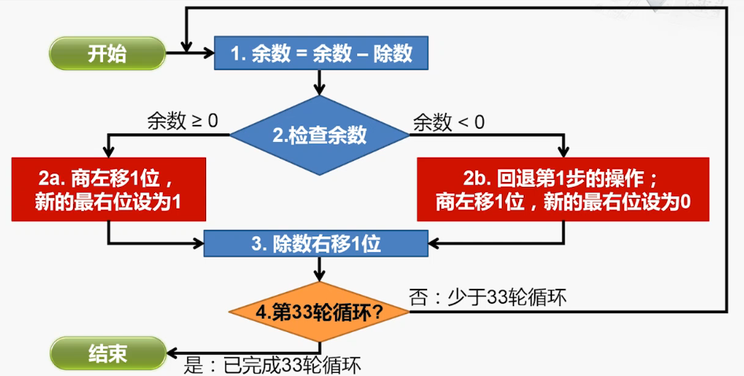
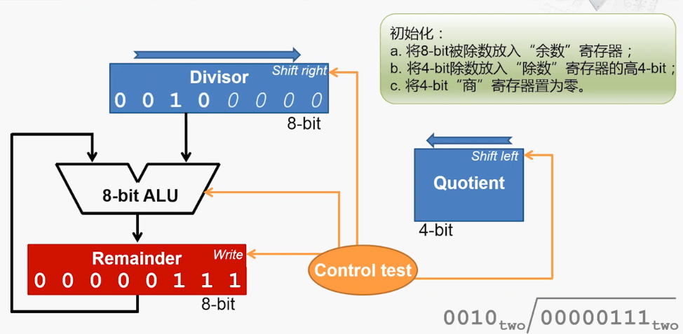

# 除法器    

> 在加减乘除中，除法是最为复杂的。    

 
 

## 1、除法器的实现      

### 分析：    

    

### 工作流程：    

    

### 具体实现：    

    

 
 

## 2、除法的优化      

    

> 由于减法的结果是无法预知的，并且其中一个分支还需要回退减法操作，所以这样的除法工作流程很难再像乘法器那样并行优化了。        

（END）    
