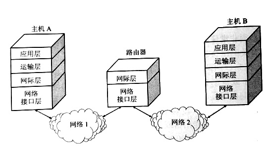
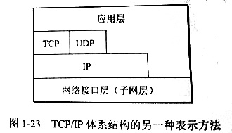
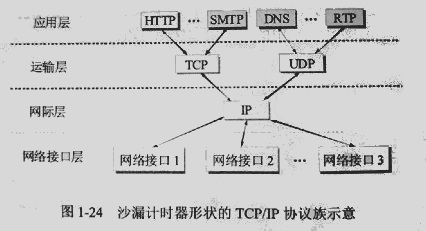

# 计算机网络体系结构    

在计算机网络的基本结构中，分层次的体系结构是最基本的。    

## 1、计算机网络体系结构的形成    

> 相互通信的两个计算机系统必须高度协调工作，这种“协调”是相当复杂的。为了设计这样复杂的计算机网络，早在最初的ARPANET设计时即提出了分层的方法。分层可以解决庞大而复杂的问题，转化为若干较小的局部问题，而这些较小的局部问题就比较容易研究和处理。    

为了使不同体系结构的计算机网络都能互连，ISO提出了一个标准框架，即著名的**开放系统互连基本参考模型(Open System Interconnection Reference Model)**，简称为**OSI**。    

> OSI只获得了一些理论研究成果，由于各种原因和其本身的问题，并未成功地市场化。如今覆盖全球的基于TCP/IP的互联网并未使用OSI标准。    

 
 

## 2、协议与划分层次    

### 协议    

> 在计算机网络中要做到有条不紊地交换数据，就必须遵守一些事先约定好的规则。这些规则明确规定了所交换的数据的格式以及有关的同步问题。    

定义：这些为进行网络中的数据交换而建立的规则、标准或约定称为**网络协议(network protocol)**，简称协议。    

- **▷协议三要素**    

1. 语法：即数据与控制信息的结构格式。  
2. 语义：即需要发出何种控制信息，完成何种动作以及做出何种响应。  
3. 同步：即事件实现顺序的详细说明。  

### 分层    

- **▷分层带来的好处**    

1. 各层之间是独立的。某一层不需要知道下一层是怎么实现的，而仅仅需要知道层间接口所提供的服务。大大降低了问题复杂程度。    
2. 灵活性好。任何一层发生变化，只要层间接口关系保持不变，则其他层不受影响。    
3. 结构上可以分割开。各层都可以采用最合适的技术来实现。    
4. 易于实现和维护。整个系统分解为若干个子系统，易于实现和维护调试。    
5. 能促进标准化工作。每一层的功能及其所提供的服务都已经有了精确的说明。    

### 体系结构    

> ref：**计算机网络的各层及其协议的集合**就是网络的**体系结构(architecture)**。换言之，计算机网络的体系结构就是这个计算机网络及其构件所应完成的功能的准确定义。    

> ref：体系结构是抽象的，而实现是具体的，是真正在运行的计算机硬件和软件。    

 
 

## 3、五层协议的体系结构    

> ref：OSI七层架构的理论完整但是复杂不实用。TCP/IP实质上只有最上面的三层，而网络接口层并没有具体的内容。所以可以二者折中一下看作五层架构的网络。    

### 应用层(Application Layer)    

应用层的任务是通过应用进程间的交互来完成特定网络应用。    

应用层协议定义的是应用进程间通信和交互的规则。应用层协议很多，例如万维网应用的HTTP协议，例如支持电子邮件的SMTP协议等。我们把应用层交互的数据单元称为**报文(message)**。    

### 运输层(Transport Layer)    

传输层的任务是负责向两台主机中进程之间的通信提供**通用的数据传输服务**。应用进程利用该服务传送应用层报文，多种应用可以使用同一个传输层服务。传输层协议主要有TCP和UDP。        

- **传输控制协议(Transmission Control Protocol, TCP)**：  

提供面向连接的、可靠的数据传输服务，其数据传输的单位是**报文段**。    

- **用户数据报协议(User Datagram Protocol, UDP)**：    

提供无连接的、尽最大努力的数据传输服务，不保证可靠性，其数据传输的单位是**用户数据报**。    

### 网络层(Network Layer)    

网络层负责为*分组交换网*上的不同主机提供通信服务。在发送数据时，网络层把传输层的*报文段*或者*用户数据报*封装成**分组(包)**进行传送。    

在TCP/IP架构中，由于网络层使用IP协议，所以分组(包)也叫**IP数据报**或者数据报。（和UDP的用户数据报不是同一个东西）    

> 无论那一层传送的数据单元，都可以笼统地用“分组(包)”表示。    

### 数据链路层(Data Link Layer)    

> 数据链路层常简称为链路层。两台主机之间的数据传输，总是在一段一段的链路上传送的，这就需要专门的链路层协议。    

在两个相邻节点之间传输数据时，数据链路层将网络层的IP数据报组装成**帧(frame)**，在相邻两个节点之间的链路上传送帧。每一帧包含数据和必要的控制信息（如同步信息、地址信息、差错控制等）。    

在接收数据时，控制信息使接收端能够知道一个帧从哪个比特开始和到哪个比特结束。这样数据链路层在收到一个帧后，就可从中提取出数据部分，上交给网络层。控制信息还使接收端能够检测所收到的帧中有无差错。    

### 物理层(Physical Layer)    

物理层传输的基本单位是比特(bit)。物理层要考虑多大的电压代表“1”或“0”，物理层还要确定连接电缆的插头应当有多少根引脚以及各引脚应如何连接。    

## 4、一些概念和补充        

**协议数据单元(Protocol Data Unit, PDU)**：OSI参考模型把对等层次之间的传送的数据单位称为该层的PDU，这一标准已经被许多非OSI标准采用。    

**协议栈(Protocol Stack)**：几个层次堆叠起来类似一个栈的结构。    

**实体(entity)**：研究开放系统中的信息交换时候，往往使用*实体*这一名词表示任何可以发送信息和接收信息的硬件或者软件进程。许多情况下，实体就是一个特定的软件模块。    

**服务访问点(SAP)**：在同一系统中相邻两层的实体进行交互的地方，通常称为*服务访问点(Service Access Point)*，它是一个抽象的逻辑接口。OSI把层与层之间交换的数据的单位称为*服务数据单元SDU*。      

 
   

## 5、TCP/IP的体系结构    

    

技术的发展并不是遵守严格的OSI分层概念。实际现在的互联网使用的TCP/IP架构如下图。某些应用程序可以直接使用IP层，甚至直接使用最下面的网络接口层。    

    

可以分层次画出具体的协议来表示TCP/IP协议族。

    

> TCP/IP协议可以为各种各样的应用提供服务(everything over IP)，同时TCP/IP协议也允许IP协议在各种各样的的网络构成的互联网上运行(IP over everything)。IP协议在互联网上具有核心作用。    

(END)    