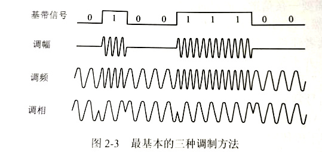

# 物理层的基本概念    

> 物理层考虑的是怎样才能在连接各种计算机的传输媒体上传输数据比特流，而不是指具体的传输媒体。    

物理层的协议也称为物理层的*规程(procedure)*，物理层的主要任务可以描述为确定与传输媒体的接口相关的一些特性。    

1. 机械特性。    
2. 电气特性。（各条线上的电压范围）  
3. 功能特性。（某条线上某一电平的电压的意义）  
4. 过程特性。（对于不同功能的各种可能事件的出现顺序）    

> 由于经济考虑，数据在通信线路上的传输方式一般都是串行传输。因此物理层还要完成传输方式的转换。    
> 具体的物理层协议种类非常多。因为物理连接的方式很多，传输媒体种类也很多。    

 
 

# 数据通信基础    

 
 

## 1、数据通信系统的模型    

一个数据通信系统可以划分为三大部分，即**源系统(发送端)**、**传输系统(传输网络)**、**目的系统(接收端)**。    

### **源系统**    

- 源点(source)：    

源点设备产生要传输的数据，源点又称为信源。    

- 发送器：  

源点生成的数字比特流要通过发送器编码后才能在传输系统中进行传输。典型的发送器就是调制器。    

### **目的系统**    

- 接收器：  

接受传输系统传送过来的信号，并把它转化为能够被目的设备处理的信息。典型的接收器就是解调器，它把来自传输线路上的模拟信号进行解调，还原比特流。    

- 终点(destination)：  

终点设备从接收器获取比特流，然后把信息输出。    

### 其他常用术语    

消息(message)：话音、文字、图像、视频都是消息。    
数据(data)：数据是传送消息的实体，是使用特定方式表示的消息。    
信号(signal)：信号是数据的电气或电磁表现。信号分为两大类-模拟信号和数字信号。    

- 模拟信号（连续信号）：    

代表消息的参数的取值是连续的。    

- 数字信号（离散信号）：  

代表消息的参数的取值是离散的。在使用时间域的波形表示数字信号时，代表不同离散数值的基本波形就称为*码元*。二进制编码只有两种码元。    

 
 

## 2、关于信道的几个基本概念    

### 三种信息交互方式    

1. **单向通信**。又称为单工通信，即只能有一个方向的通信而没有反方向的交互。无线电广播就是这类。    
2. **双向交替通信**。又称为半双工通信(有的称为单工)，即通信双方都可以发送信息，但是不能同时发送。    
3. **双向同时通信**。又称为全双工通信，即通信双方可以同时发送和接收信息。    

> 单向通信只需要一条信道，而双向交替通信和双向同时通信都需要两条信道。      

### 调制    

来自信源的信号常称为**基带信号**，即基本频带信号。像计算机输出的各种文字或图像文件。基带信号往往包含较多的低频成分甚至直流成分，所以通常需要进行**调制**才能传输。    

第一类调制是仅仅对基带信号的波形进行交换，使它能够与信道特性相适应，变换后的信号仍然是基带信号，称为基带调制。由于这种基带调制是把数字信号转换为另一种形式的数字信号，所以人们更愿意称之为**编码**。    

第二类调制则需要使用载波(carrier)进行调制，把基带信号的频率范围搬至较高频段，并转换为模拟信号，这样就能更好地在模拟信道上传输，经过载波调制的信号称为**带通信号(仅在一段频率范围内能够通过信道)**，使用载波的调制称为**带通调制**。    

- **常用编码方式**：  

    

1. 不归零制。正电平代表1，负电平代表0。
2. 归零制。正脉冲代表1，负脉冲代表0。  
3. 曼彻斯特编码。位周期中心的上跳(CRE:上升沿)代表0，位中心的下跳(CRE：下降沿)代表1。也可以反过来定义。
4. 差分曼彻斯特编码。在每一位的中心始终有跳变。在位开始边界有跳变代表0，位开始没有跳变代表1。    

> 曼彻斯特编码产生的信号频率比不归零制高。    
> 不归零制不能从信号波形本身提取信号时钟频率，即没有自同步能力。而曼彻斯特编码有自同步能力。      

- **基本的带通调制方法**：    

    

1. 调幅(AM)。即载波的振幅随基带数字信号变化。    
2. 调频(FM)。即载波频率随基带数字信号变化。  
3. 调相(PM)。即载波的初始相位随基带信号变化。    

> 为了达到更高的信息传输效率，必须采用技术上更为复杂的多元制的振幅相位混合调制方法。例如*正交振幅调制(QAM)*。    

 
 

## 3、信道的极限容量    

限制码元在信道上的传输效率的因素主要有两个：信道能够通过的频率范围和信噪比。    

### 信道能够通过的频率范围    

具体的信道所能通过的频率范围是有限的。信号中许多高频分量往往不能通过信道。如果高频分量在传输时收到衰减，就会使得波形上升沿和下降沿变得不那么陡峭，失去了清晰界限，这种现象称为**码间串扰**。    

- 奈奎斯特准则：任何信道中，码元传输的速率是有上限的，传输速率超过上限，就会出现严重的码间串扰问题，使得接收端对码元的识别变得不可能。    

### 信噪比    

噪声存在于所有电子设备和通信信道中。信噪比就是信号的平均功率和噪声的平均功率之比，常记为S/N。    

### 香农公式    

$C=Wlog_2(1 + S/N)$    

> C为信道的极限信息传输速率。W为信道带宽。    

> 香农公式表明，信道的带宽或信道中的信噪比越大，信息的极限传输速率就越高。香农公式指出了信息传输速率的上限。香农公式的意义在于，只要信息传输速率低于信道的极限传输速率，就一定存在某种办法来实现无差错传输。）    

> 如果信噪比不能再提升了，并且码元传输速率也达到上限值，还可以让每一个码元携带更多比特的信息量。    

（END）  

