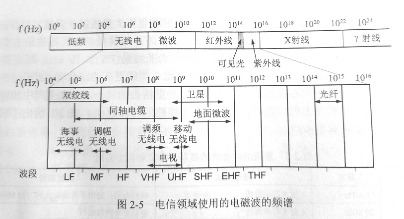

# 物理层下面的传输媒体    

> 传输媒体，或称传输介质，分为导引型传输媒体和非导引型传输媒体。    

> 导引型传输媒体中，电磁波被导引沿着固体媒体传播。而非导引型传输媒体就是自由空间，在非导引型传输媒体中电磁波的传输常称为无线传输。    

 
 

## 1、导引型传输媒体    

### 双绞线    

双绞线把两个互相绝缘的导线并排放在一起，并通过绞和(twist)减少相邻导线的电磁干扰。    

> 双绞线使用最多的地方是电话线。    
> 数字和模拟传输都可以使用双绞线。    

为了提高双绞线抗干扰能力，可以在双绞线的外面再加上一层用金属丝编织成的屏蔽层，这就是*屏蔽双绞线(Shielded Twist Pair, STP)*。    

### 同轴电缆    

同轴电缆由内导体铜质芯线、绝缘层、网状编织的外导体屏蔽层以及保护塑料外层所组成。    

同轴电缆具有很好的抗干扰特性，被广泛应用于传输较高速率的数据。    

> 同轴电缆主要应用于有线电视网的居民小区中。    

### 光缆    

光纤通信利用光导纤维传递光脉冲来进行通信（有光脉冲代表1，无光脉冲代表0）。    
由于可见光频率非常高，因此光纤通信的传输带宽远远大于目前其他各种传输媒体的带宽。    

在发送端可以采用发光二极管或者半导体激光器，它们在电脉冲的作用下产生光脉冲。在接收端可用光电二极管做出光检测器，还原电脉冲。    

光纤可以分为*多模光纤*和*单模光纤*。由于光脉冲在多模光纤中传输时会逐渐展宽，造成失真，因此多模光纤只适合近距离传输。    

> 光纤现在广泛应用于计算机网络、电信网络、有线电视网络的主干网络中，在高速局域网也使用得很多。    

 
 

## 2、非导引型传输媒体    

在非导引型传输媒体中电磁波的传输常称为无线传输。    

    

(END)  

