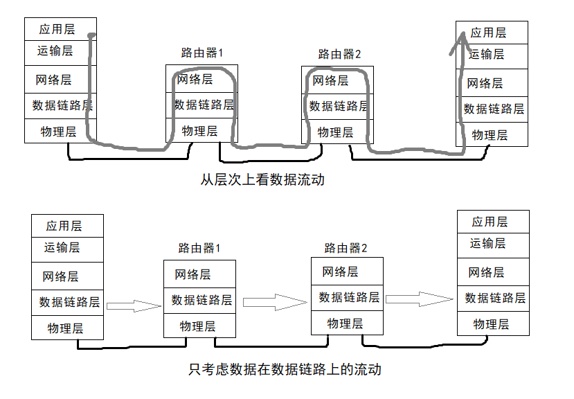

# 数据链路层概述    

数据链路层使用的信道主要有*点对点信道*和*广播信道*两种类型。点对点信道使用一对一的通信方式。广播信道使用一对多的广播通信方式，因此过程比较复杂。广播信道上的主机很多，因此必须使用专用的共享信道协议来协调这些主机的数据发送。    

    

 
 
 

# 使用点对点信道的数据链路层    

## 1、数据链路和帧    

- **链路(link)**    

就是从一个节点到相邻节点的一段物理线路(有线或无线)，而中间没有任何其他的交换节点。在进行数据通信时，两台计算机之间的通信路径往往要经过许多段这样的链路，可见链路只是一条路径的组成成分。    

- **数据链路(data link)**    

则是另一个概念。这是因为当需要在一条线路上传送数据时，除了必须要有一条物理线路外，还必须有一些必要的通信协议来控制这些数据的传输。若把实现这些协议的硬件和软件加到链路上，就构成了数据链路。    

- **网络适配器**    

现在最常用的方法是使用*网络适配器*(包含硬件和软件)来实现这些协议。一般的适配器都包括了数据链路层和物理层这两层的功能。    

`链路(物理链路) + 通信协议 = 数据链路(逻辑链路)`    

- **帧(frame)**    

数据链路层把网络层交下来的数据构成*帧*发送到链路上，以及把接收到的帧中的数据取出并上交给网络层。    

> 数据链路层不必考虑物理层如何实现比特传输的细节，可以简单地设想好像是沿着两个数据链路层之间的水平方向把帧直接发送给对方。    

 
 

## 2、三个基本问题    

### 封装成帧    

> 封装成帧就是在一段数据的前后分别添加首部和尾部，这样就构成了一个帧。    

> 首部和尾部的一个重要作用就是进行*帧定界*。此外，首部和尾部还包括许多必要的控制信息。    
> 为了提高帧的传输速率，应当使帧的数据部分尽可能地大于首部和尾部的长度。但是每种数据链路层协议都规定了帧的数据部分长度上限-**最大传送单元(MTU)**。    
> 当数据是ASCII码数据文件时，帧定界可以使用特殊的帧定界符。即不可打印的控制字符。    

### 透明传输    

> 由于帧的开始和结束的标记使用专门指明的控制字符，因此所传输的数据中任何8比特的组合一定不允许和帧定界符的比特编码一致。    

> 如果是文本文件那么显然不会出现帧定界控制字符，不管键盘输入什么字符都能放在帧中传输过去，这样的传输就是透明传输。    

> 如果是二进制文件，如果数据中的某个字节的二进制代码恰好和帧定界控制字符一样，否则就会错误地找到帧边界。    

> 为了解决透明传输问题，就必须设法使数据中可能出现的控制字符在接收端不被解释为控制字符。具体的方法是在出现控制字符的前面插入一个**转义字符**"ESC"，而在接收端的数据链路层把数据给网络层之前删除这个插入的转义字符。这种方法称为*字符填充*或者*字节填充*。    

### 差错控制    

- **比特差错**    

> 比特在传输的过程中可能会产生差错，1和0可能会改变，称为*比特差错*，传输错误的比特占总传输比特数的比率称为**误码率(EBR)**。    

> 在计算机网络传输数据时，必须采用各种差错检测措施。目前在数据链路层广泛使用了**循环冗余检验(Cyclic Redundancy Check, CRC)**的检错技术。    

> CRE：**CRC的原理简单可概括为：先约定一个除数，发送时在每组比特后面加上计算好的冗余码FCS，使得除以除数的余数为0。在接受时再用除法验证余数是否为0，如果是0就认为无差错。**    

> 冗余码增大了传输开销，但是为了避免差错这种代价是值得的。在数据链路层，发送端冗余码的生成和接收端的CRC检验都是硬件完成的，处理很迅速。    

- **其他差错**    

> 使用CRC检验，只能保证接收的帧都无比特差错，还不是可靠传输。    
> 除了最基本的比特差错，还有*帧丢失*、*帧重复*、*帧失序*这些情况，这些属于出现传输差错。    

> OSI的观点是必须让数据链路层向上提供可靠传输。因此在CRC检错的基础上，增加了帧编号、确认和重传机制。    

> 由于现在的通信线路质量已经大大提高了，所以现在的互联网就采取了区别对待。对于质量好的有线传输链路，数据链路层不使用确认和重传机制，即不要求向上提供可靠传输服务，把纠错的任务交给上层协议例如TCP来完成。对于通信质量差的无线传输链路，数据链路层使用确认和重传机制，向上提供可靠服务。    

（END）    
