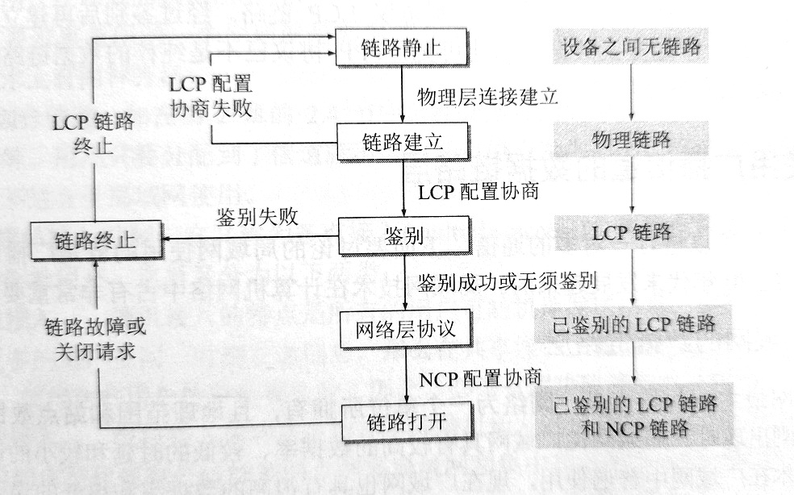

# 点对点协议PPP    

> 在通信线路质量较差的年代，在数据链路层使用可靠传输协议曾经是一个好办法。能够实现可靠传输的**高级数据链路控制HDLC**就成了当时比较流行的数据链路层协议。    

> 但是现在HDLC已经很少用了。对于点对点的链路，简单得多的**点对点协议PPP**则是目前使用最广泛的数据链路层协议。    

 
 

## 1、PPP协议的特点    

> 互联网用户通常要连到某个ISP才能接入互联网，PPP协议就是用户计算机和ISP进行通信时所使用的数据链路层协议。    

### PPP协议设计需求    

1. **简单。**对于数据链路层的帧，不需要纠错，不需要序号。如果CRC检验正确就收下，反之则丢弃这个帧，其他什么都不做。（是由TCP来负责可靠传输）    
2. **封装成帧。**PPP协议必须规定特殊的字符作为帧界定符。        
3. **透明性。**PPP协议必须保证数据传输的透明性。        
4. **多种网络层协议。**PPP协议必须能在同一条物理链路上同时支持多种网络层协议。        
5. **多种类型链路。**必须能在多种类型的链路上运行。        
6. **差错检测。**检测并丢弃有差错的帧。    
7. **检测连接状态。**PPP协议必须有一种机制能够及时地自动检测出链路是否正常工作。    
8. **最大传输单元。**PPP协议必须对每一种类型的点对点链路设置MTU。    
9. **网络层地址协商。**PPP协议必须提供一种机制使得通信的两个网络层的实体能够通过协商知道或能够配置彼此的网络层地址。    
10. **数据压缩协商。**PPP协议必须提供一种方法来协商使用数据压缩算法。    

### PPP协议的组成    

1. 一个将IP数据报封装到串行链路的方法。    
2. 一个用来建立、配置、测试数据链路连接的*链路控制协议(LCP)*。    
3. 一套*网络控制协议(NCP)*，其中的每一个协议支持不同的网络层协议，如IP协议、DECnet等。  

 
 

## 2、PPP协议的帧格式    

### 各字段意义    

|(F)0x7E|(A)0xFF|(C)0x03|协议|信息部分|FCS|(F)0x7E|  
|-|-|-|-|-|-|-|   

> PPP协议的首部和尾部分别为4个字段和2个字段。    

> 首部第一个字段和尾部最后一个字段是标志字段F(Flag)，规定为`0x7E`。标志字段就是PPP帧的定界符，表示帧的开始或结束。连续两帧之间只需要一个标志字段。    

> 首部中的第二个字段即地址字段A规定为`0xFF`，第三个字段即控制字段C规定为`0x33`。最初曾考虑以后再对这两个字段进行其他定义，但至今也没给出。    

> 首部第四个字段是两字节的协议字段，当协议字段为`0x0021`时，信息字段就是IP数据报，如果是`0xC021`，则信息字段是PPP链路控制协议LCP的数据，而`0x8021`表示这是网络层的控制数据。    

> 当信息字段出现和标志字段一样的`0x7E`时，就必须采取一些措施。异步传输时，使用字节填充。同步传输时，使用零比特填充。    

### 字节填充（异步传输）      

当PPP使用异步传输时，它把转义字符定义为`0x7D`，并使用字节填充。    

填充方法：  
1. `0x7E`转变为`(0x7D,0x5E)`。    
2. `0x7D`转变为`(0x7D,0x5D)`。    
3. 每个ASCII控制字符(即小于0x20的字符)，在该字符的前面加上`0x7D`，同时将该字符的编码进行改变。    

### 零比特填充（同步传输）    

PPP协议在用SONET/SDH链路时，使用同步传输(一连串的比特连续传输)而不是异步传输(逐字符传输)。这种情况下，PPP协议采用零比特填充法实现透明传输。    

零比特填充的具体做法是：已知`0x7E`的二进制码是`01111110`，在发送端先扫描整个信息字段，只要发现有5个连续1，立即填入一个0，这样就可以保证在信息字段中不会出现6个连续1。在接收端再删除5个连续1后的一个0，来还原为原来的比特流。这样就保证了透明传输。    

 
 

## 3、PPP协议的工作状态    

  

> PPP链路的起始和终止状态永远是**链路静止**状态，这时候在用户个人电脑和ISP的路由器之间并不存在物理层的连接。    

> 用户电脑通过调制解调器呼叫路由器时，路由器就能检测到调制解调器发出的载波信号。在双方建立了物理层连接后，PPP就进入**链路建立**状态，其目的是建立链路层的LCP连接。    

> 这时LCP开始协商一些**配置选项**，即发送LCP的配置请求帧。该PPP帧的协议字段为LCP对应的代码，而信息字段包含特定的配置请求。链路的另一端可以发送**配置确认帧**或**配置否认帧**或**配置拒绝帧**。    

> 协商结束后双方就建立了LCP链路，接着进入**鉴别**状态，在这一状态，只允许传送LCP协议的分组、鉴别协议的分组以及监测链路质量的分组。    

> 在**网络层协议**状态，PPP链路的两端的网络控制协议NCP根据网络层的不同协议互相交换网络层特定的网络控制分组。    

> 当网络层配置完毕后，链路就进入可以进行数据通信的**链路打开**状态。    

> 数据传输结束后，可以由链路的一端发出终止请求LCP分组请求终止链路连接，在收到对方发来的终止确认LCP分组后，转到**链路终止**状态。如果链路出现故障，也会从**链路打开**状态转到**链路终止**状态。当调制解调器的载波停止后，则回到**链路静止**状态。      

- 总结        

从设备之间无链路开始，到先建立物理链路，再建立链路控制协议LCP链路。经过鉴别后再建立网络控制协议NCP链路，然后才能交换数据。    

由此可见，PPP协议已不是纯粹的数据链路层协议，它还包含了物理层和网络层的内容。    

(END)    
