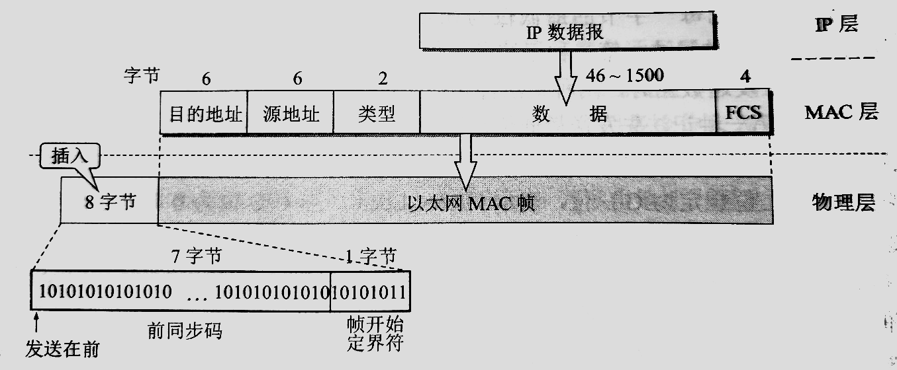

# 使用广播信道的数据链路层    

> 广播信道可以进行一对多通信，下面讨论的局域网使用的就是广播信道，局域网技术在计算机网络中占有非常重要的地位。    

 
 

## 1、局域网的数据链路层    

> 局域网不仅仅和数据链路层有关，但是局域网技术中有关数据链路层的内容很丰富。    

- **局域网特点**：    

网络为一个单位所拥有，且地理范围和站点数均有限。    

- **局域网优点**：  

1. 具有广播功能。从一个站点可以方便地访问全网。共享局域网资源。    
2. 便于系统的扩展，各设备的位置可以灵活调整和改变。    
3. 提高了系统的可靠性、可用性、生存性。    

- **传输媒体**：  

局域网可以使用多种传输媒体，最主流的是双绞线。当数据率很高时，往往需要使用光纤作为传输媒体。    

- **共享信道**：    

共享信道要着重考虑的一个问题就是如何使众多用户能够合理和方便地共享通信媒体资源。技术上有*静态划分信道*和*动态媒体接入控制*这两种。    

**静态划分信道**就是频分复用、时分复用、波分复用、码分复用等。这种划分信道的方法代价较高，不适用于局域网。    

**动态媒体接入控制**又称为多点接入，其特点是信道并非在用户通信时固定分配给用户。分为*随机接入*和*受控接入*。    

**随机接入**(重点讨论)的特点是所有用户可随机发送信息，由于多用户同时发送信息会产生碰撞，所以必须要有解决碰撞的网络协议。    

**受控接入**的特点是用户不能随机地发送信息而必须服从一定的控制。这类的典型代表有分散控制的令牌环局域网和集中控制的多点线路轮询(polling)。受控接入目前在局域网中使用得较少。    

### 以太网(Ethernet)    

> 以太网是美国Xerox公司的PaloAlto研究中心于1975年研制成功的。那时，以太网是一种基带总线局域网。以太网用无源电缆作为总线来传送数据帧，并以假想的电磁波介质*以太(Ether)*来命名。    

> 以太网有两个标准，即DIX Ethernet V2和IEEE 802.3标准。两个标准只有很小的差别，但是严格来说“以太网”应当是指符合DIX Ethernet v2标准的局域网。    

> IEEE把局域网数据链路层拆为*逻辑链路控制(LLC)*和*媒体接入控制(MAC)*两个子层。由于互联网发展很快而TCP/IP体系经常使用的局域网只剩下DIX Ethernet V2而不是IEEE 802.3标准中的局域网，所以IEEE 802委员会制定的LLC的作用已经消失了。    

### 适配器    

计算机与局域网的连接是通过通信 **适配器(adapter)** 进行的。    

> 适配器本来是在机箱内插入的一块网络接口板，这种接口板称为 **网络接口卡(NIC)** 或简称网卡。由于现在的计算机主板都已经嵌入这种适配器，不再使用单独的网卡了。

适配器和局域网之间的通信是通过电缆或者双绞线以串行传输方式进行的。适配器和计算机之间的通信是通过计算机I/O总线以并行传输方式进行的。    

适配器的一个重要功能是进行串行和并行方式的转换。由于网络数据率和计算机总线上的数据率不同，因此还需要进行缓存的存储芯片。    

除此之外还必须把管理该适配器的设备驱动程序安装在操作系统中，这个驱动程序告诉适配器应当从存储器什么位置上把多长的数据块发送到局域网，或者应当在存储器什么位置上存储局域网传送来的数据。    

适配器接收和发送各种帧时，不使用计算机CPU。收到正确的帧时，他就使用中断来通知计算机，并交付协议栈中的网络层。    

 
 

## 2、CSMA/CD协议    

> 早期的局域网都是将许多计算机连接到一根总线上的。当一台计算机发送数据时，其他计算机都能检测到这个数据，这种就是广播通信方式。但是我们并不总是要在局域网上进行一对多广播通信。为了在总线上实现一对一通信，可以使每台计算机的适配器都拥有一个与其他适配器不同的地址，在发送数据帧时在帧首部写明接收站地址，以实现一对一通信。    

> CRE：简而言之就是，广播通信的总线式局域网可以利用设备地址来实现一对一通信。    

### **以太网采取的一些措施**    

采用较灵活的**无连接**工作方式，即不必建立连接就能直接发送数据，适配器对发送的数据帧不编号也不要求对方发回确认。对有差错帧是否需要重传则由高层决定。（局域网信道质量好，产生差错概率小）      

同一时间只能允许一台计算机发送数据。以太网采用最简单的随机接入，但有很好的协议用来减少冲突的发生。以太网采用的协议是**载波监听多点接入/碰撞检测(CSMA/CD)**。    

以太网发送的数据都使用**曼彻斯特编码**的信号。基带信号无法从接收到的一长串连1或者连0比特流中提取比特同步信号，而曼彻斯特编码可以很方便地提取比特同步信号。但曼彻斯特编码也有缺点，就是它所占的频带宽度比基带信号增加了一倍。      

### **CSMA/CD协议的要点**    

- **多点接入**    

说明这是总线型网络，许多计算机以多点接入的方式连接在一根总线上。
协议的本质是“载波监听”和“碰撞检测”。    

- **载波监听**    

载波监听就是利用电子技术检测总线上有没有其他计算机在发送。（其实总线上并没有什么载波，只是借用一下这个名词。）不管是发送前还是发送中，都必须不停地检测信道。发送前检测信道只有信道空闲时才能获得发送权。发送中检测信道，是为了及时发现有没有其他站的发送和本站发送的碰撞，称为碰撞检测。    

- **碰撞检测**    

碰撞检测也就是边发送边监听，即适配器边发送数据边检测信道上的信号电压的变化情况，以便判断自己在发送数据时其他站是否也在发送。当几个站同时发送数据时，总线上的信号电压会叠加，当适配器检测到的电压变化幅度超过一定值，就认为有多个站在同时发送数据。发生碰撞时要立即停止发送，免得继续进行无效发送，然后等待一段随机时间后再次发送。    

- **碰撞窗口**    

发送数据之间已经监听到信道为“空闲”，之所以还会发生碰撞，是因为电磁波在总线上的传播时延(约5μs/1km)。每一站在自己发送数据后的一小段时间内，存在着遭遇碰撞的可能性，称为发送的不确定性。所以存在一个*争用期*或者说*碰撞窗口(collision window)*，经过争用期还没有检测到碰撞，才能肯定这次发送不会发生碰撞。    

- **退避**    

以太网使用*截断二进制指数退避*算法来确定碰撞后重传的时机。这种算法让发生碰撞的站在停止发送数据后，不是等待信道空闲后立即发送，而是退避一个随机时间，防止再次碰撞。    

以太网每发送完一帧，一定要把已发送的帧暂时保留一下了。如果在争用期检测出碰撞，那么还要再推迟一段时间后把这个暂时保留的帧重传一次。    

以太网规定了一个最短帧长(512bit)，如果发送的数据非常少就必须加入一些填充。这样如果发生碰撞，已经发送的数据一定小于512bit，收到了小于512bit的帧都是由于冲突而异常终止的无效帧，应当立即丢弃。    

- **强化碰撞**    

当发送数据的站一旦发现发生了碰撞，除了立即停止发送数据外，还要继续发送一段人为干扰信号，以便让所有用户知道现在已经发生了碰撞。    

 
 

## 3、使用集线器的星形拓扑    

> 传统以太网最初是使用粗同轴电缆，后来演进到使用较便宜的细同轴电缆，最后发展为使用更便宜和灵活的双绞线。这种以太网采用*星形拓扑*，在星形的中心增加了一个可靠性非常高的设备，叫做*集线器(hub)*。    

双绞线以太网总是和集线器配合使用的。每个站需要用两对无屏蔽双绞线，分别用于接收和发送，双绞线的两端使用RJ-45插头。    

> 1990年IEEE制定出星形以太网10BASE-T标准，即“10Mbit/s数据率-基带信号-双绞线”。    

### 集线器的一些特点    

1. 集线器物理上是一个星形网，但是由于整个系统仍然像一个传统以太网那样运行，**逻辑上还是一个总线网，使用的仍然是CSMA/CD协议。**网络中的各站必须竞争对传输媒体的控制，并且同一时刻只允许至多一个站发送数据。    
2. 一个集线器有许多接口，每个接口通过RJ-45插头用两对双绞线与计算机的适配器相连。因此，一个集线器很像一个多接口的转发器。    
3. **集线器工作在物理层**，每个接口只负责简单地转发比特，**不进行碰撞检测**，发生碰撞时所有接口都收不到正确的帧。    
4. 集线器采用了专门的芯片，进行自适应串音回波抵消，减少了信号干扰。    

 
 

## 4、※以太网的信道利用率※    

- 定义：参数a  
$a = {τ \over {T_0}}$    

> 以太网中定义了参数a，它是以太网**单程端到端时延(τ)与帧发送时间(T0)之比**。    

- 定义：极限信道利用率Smax  
$S_{max} = {T_0 \over {T_0 + τ}} = {1 \over {1 + a}}$    

> 这是一种理想化情况，即各站发送的数据都不会产生碰撞(显然已经不是CSMA/CD协议)，并且总线一旦空闲就有某一个站立即发送数据。    

   
   

## 5、以太网的MAC层    

### MAC层的硬件地址    

局域网中，**硬件地址**又称为**物理地址**或者**MAC地址**。（因为这种地址用在MAC帧中）    

> 严格上讲，局域网的地址实际上是每个站的名字(或者说标识符)，地址是个不太严格的说法。    
> MAC地址前三个字节是硬件厂家向IEEE购买的地址块，即**组织唯一标识符OUI**。后三字节由厂家自行指派，称为**扩展的唯一标识符(EUI)**。    

适配器从网络上每收到一个MAC帧就先用硬件检查MAC帧中的目的地址。如果是发往本站的就收下，否则就丢弃。“发往本站的帧”包括单播帧(帧的MAC地址与本站硬件地址一致)、广播帧(全1地址)、多播帧。    

> 以太网适配器还可设置为一种特殊的工作方式，即**混杂方式(promiscuous mode)**。工作在混杂模式的适配器只要听到有帧在以太网上传输就悄悄接受下来，不管这些帧是发往哪个站。    

### MAC帧的格式    

MAC帧的格式有两种标准，即DIX Ethernet V2标准和IEEE 802.3标准。   

- Ethernet V2的MAC帧格式：    

    

> 类型字段标识上一层使用的是什么协议，例如`0x0800`表示上层使用的是IP协议。    

> 这种帧格式中，首部没有一个帧长度字段。因为在曼彻斯特编码下，电压不再变化就意味着结束了。    

> 帧长度不足时的填充字段由上层来负责丢弃。例如当上层使用IP协议时，其首部就有一个“总长度”字段。    

> MAC子层向下传到物理层还需要在前面插入两个字段。第一个字段-**前同步码**的作用是使接收端的适配器在接收MAC帧时能迅速地调整其时钟频率，使之与发送端时钟同步。第二个字段-**帧开始定界符**`10101011`，前六位作用和前同步码相同，最后两个1就是告诉接收端适配器准备接收数据。    

> 以太网传送帧时，各帧之间还必须有一定的间隙。因此接收端只要找到帧开始定界符，其后面的连续到达的比特流都属于同一个MAC帧。可见以太网不需要使用帧结束定界符，也不需要字节插入来保证透明传输。（CRE：这和PPP帧明显不同）    

- IEEE 802.3标准的MAC帧格式：    

> 与EthernetV2的MAC帧格式区别只有两个。    

> 第一，IEEE802.3的MAC帧第三个字段是“长度/类型”，当这个字段大于`0x0600`时就表示类型，这样的帧和EthernetV2的MAC帧就完全一致。当它小于`0x0600`时表示MAC帧数据部分长度。（在曼彻斯特编码下，长度字段无意义）      

> 第二，当“长度/类型”字段小于`0x0600`时，数据字段必须装入逻辑链路控制LLC子层的LLC帧。（现在广泛使用的局域网只有Ethernet，因此LLC帧已经失去了原来的意义）      

（END）    

