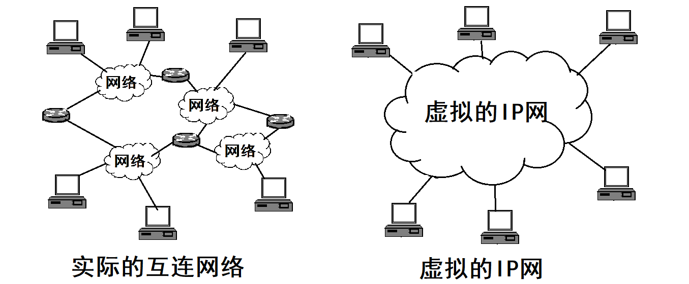
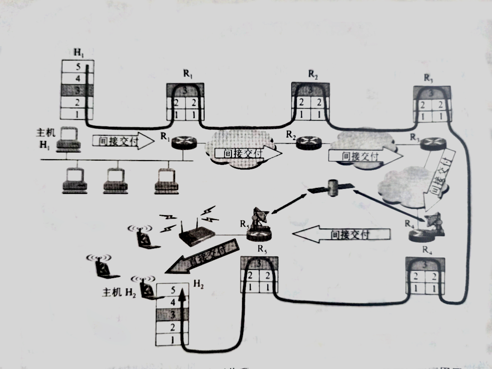
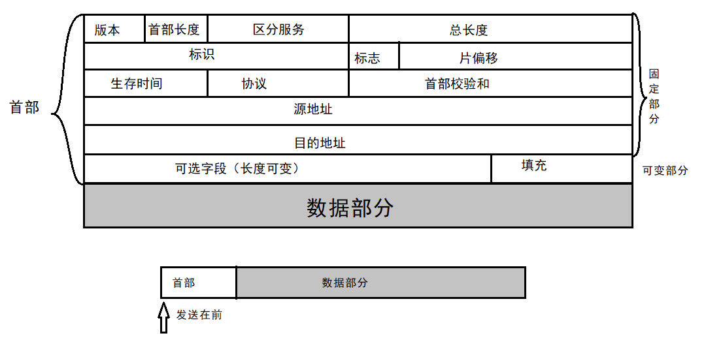
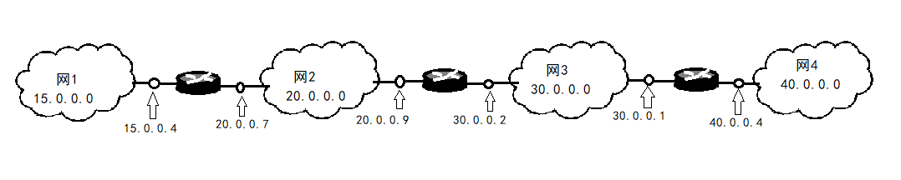

# 网际协议IP    

> IP协议又称为Kahn-Cerf协议。    

- **与IP协议配套使用的还有三个协议：**    
1. 地址解析协议ARP(Address Resolution Protocol)  
2. 网际控制报文协议ICMP(Internet Control Message Protocol)  
3. 网际组管理协议IGMP(Internet Group Management Protocol)    

- **为什么要用IP地址而不直接用硬件地址进行通信？？**    

> 既然在网络链路上传送的帧最终是按照硬件地址找到目的主机的，那么为什么要用抽象的IP地址，而不直接使用硬件地址进行通信？？    

> 原因是全世界存在各式各样的网络，它们使用不同的硬件地址。要是这些异构网络能互相通信，就必须进行非常复杂的硬件地址转换工作，因此由用户或者用户主机来完成这项工作几乎是不可能的。    

 
 

## 1、虚拟互连网络    

> 如果在全世界范围内把数以万计的网络都互连起来，并且能够互相通信，那么这样的任务一定非常复杂，会遇到很多需要解决的问题。但是又不能让所有人使用相同的网络，因为没有一种单一的网络能满足所有用户的需求，而网络的制造厂家也要经常推出新的网络，在竞争中求生存。因此，在市场上有很多种不同性能、不同网络协议的网络，供不同用户使用。      

- **将网络互相连接起来需要一些中间设备：**  

1. 物理层使用的中间设备叫做**转发器(repeater)**。    
2. 数据链路层使用的中间设备叫做**网桥(bridge)**。  
3. 网络层使用的中间设备叫做**路由器(router)**。    
4. 网络层以上使用的中间设备叫做**网关(gateway)**。用网关连接两个不兼容的系统需要在高层进行协议转换。    

> 当中间设备是转发器或者网桥时，仅仅是把一个网络扩大了，而从网络层的角度看，这仍然是一个网络，一般不称之为网络互连。    
> 网关比较复杂，目前使用较少。由于历史的原因，有些TCP/IP的文献曾经把路由器称为网关。      

- **虚拟互连网络的定义：**    

    

> 上图表示有许多计算机网络通过一些路由器进行互连。    

> 参与互连的计算机网络都使用相同的*网际协议IP*，因此可以把互连以后的计算机网络看成一个**虚拟互连网络**。所谓虚拟互连网络也就是逻辑互连网络，它的意思就是互连的各种物理网络的异构性本来是客观存在的，但是我们利用IP协议就可以使得这些性能各异的网络**在网络层看起来好像是一个统一的网络**。    

> 这种使用IP协议的虚拟互连网络可简称为**IP网**，当IP网上的主机进行通信时，就好像在一个单一网络上通信一样，看不见各网络的具体异构细节。    

- **直接交付和间接交付**    

    

> 上图所示的互连网中的源主机H1要把数据报发送给目的主机H2。根据分组交换的存储转发概念，主机H1先要查找自己的路由表，看目的主机是否就在本网络上，如果是就不需要经过任何路由器而是**直接交付**，任务就完成了。    

> 如果目的主机不在本网络上，则必须把IP数据报发送给某个路由器R1，路由器R1在查找自己的路由表后，知道应当把数据报转发给R2进行**间接交付**。这样一直转发下去，最后由路由器R5知道自己是和H2连接在同一个网络上，于是把数据报**直接交付**给目的主机H2。    

> 主机的协议栈共有5层，但是路由器的协议栈只有下面3层。    

 
 

## 2、IP地址    

> TCP/IP体系中，IP地址是一个最基本的概念。    

### IP地址及其表示方法    

> 整个互联网就是一个单一的、抽象的网络。IP地址就是给互联网上的每一台主机或路由器的每一个接口分配一个在全世界范围内是唯一的32位标识符。    

> IP地址的结构使我们可以在互联网上很方便地进行寻址。IP地址现在由*互联网名字和数字分配机构(ICANN)*进行分配。    

- **IP地址编址方法的三个历史阶段：**    

1. 分类的IP地址。最基本的编址方法。    
2. 子网划分。对最基本的编址方法的改进。    
3. 构成超网。比较新的无分类编址方法。    

- **分类的IP地址：**    

“分类的IP地址”就是将IP地址划分为若干个固定类，这里面的A类、B类、C类地址都是由两个固定长度的字段组成。    

第一个字段是**网络号(net-id)**，它标志主机或路由器所连接到的网络。一个网络号在整个互联网范围内必须是唯一的。    

第二个字段是**主机号(host-id)**，它标志该主机或路由器。一台主机号在它前面的网络号所指网络范围内必须是唯一的。    

由此可见，一个IP地址在整个互联网范围内是唯一的。这种两级的IP地址可记为`IP地址 ::= {<网络号>, <主机号>}`。        

A类地址：  
|0┊网络号(8位)|主机号(24位)|
|-|-|  

B类地址：  
|10┊网络号(16位)|主机号(16位)|
|-|-|  

C类地址：  
|110┊网络号(24位)|主机号(8位)|
|-|-|  

D类地址：  
|1110┊多播地址|
|-|  

E类地址：  
|1111┊保留为今后使用|
|-|  

> A类、B类、C类地址的网络号字段分别为1个、2个、3个字节，而在网络号字段的最前面有1~3位的*类别位*。A类、B类、C类地址的主机号字段分别为3个、2个、1个字节。    

> D类地址用于多播。E类地址保留为以后用。    

> 近年来已经广泛使用无分类IP地址进行路由选择，A类、B类、C类的地址区分已经成为了历史。    

- **IP地址的一些重要特点：**    

1. 每个IP地址都有网络号和主机号组成。IP地址管理机构再分配IP地址时只分配网络号，而主机号由得到该网络号的单位自行分配。    
2. 实际上IP地址是一台主机或路由器和一条链路的接口。当一台主机同时连到两个网络上时，该主机就同时具有两个IP地址，其网络号必须是不同的。    
3. 按照互联网观点，一个网络是指具有相同网络号net-id的主机的集合，因此，用转发器或网桥连接起来的若干局域网仍为一个网络。    
4. 在IP地址中，所有分配到网络号的网络（不管是范围很小的局域网，还是可能覆盖很大地理范围的广域网）都是平等的。    

- **注意事项：**    

1. 用网桥（数据链路层工作）互连的网络仍然是一个局域网，只能由一个网络号。    
2. 路由器总是具有两个或以上的IP地址。即路由器每个接口都有一个不同网络号的IP地址。    
3. 两个路由器直接相连时，在连线两端的接口处可以分配也可以不分配IP地址。如果分配了地址，则这一段连线就构成了一种只包含一段线路的特殊网络。但是为了节省IP资源，对于这种特殊网络现在也常常不分配IP地址，通常把这样的特殊网络称为**无编号网络(unnumbered network)**或者**匿名网络(anonymous network)**。    

 
 

## 3、IP地址和硬件地址    

从层次的角度看，**物理地址是数据链路层和物理层使用的地址**，而**IP地址是网络层和以上各层使用的地址，是一种软件实现的逻辑地址**。    

IP地址放在IP数据报的首部，而硬件地址放在MAC帧的首部。    

### 注意事项    

> 虽然在IP数据报首部有源IP地址，但是路由器只根据目的IP地址的网络号进行路由选择。    

> 尽管互连在一起的网络的硬件地址体系各不相同，但IP层抽象的互联网却屏蔽了下层这些复杂的细节。只要我们在网络层上讨论问题，就能使用统一的、抽象的IP地址研究主机和主机或路由器之间的通信。    

 
 

## 4、地址解析协议ARP    

已经知道一个主机或路由器的IP地址，需要找出其相应的物理地址。地址解析协议ARP就是用来解决这个问题的。    

地址解析协议ARP解决这个问题的方法是在主机ARP高速缓存中存放一个从IP地址到硬件地址的映射表，并且这个映射表还要经常动态更新。    

ARP对于保存在高速缓存的每个映射地址都设置**生存时间**。凡是超过生存时间的项目就从高速缓存中删除掉。    

- **本局域网上解析**    

ARP进程在本局域网广播发送一个ARP请求分组。在本局域网所有主机上运行的ARP进程都接收到此ARP请求分组。    

主机B的IP地址与ARP请求分组要查询的IP地址一致，就收下这个ARP请求分组，并向主机A发送ARP响应分组，在这个响应分组中写入自己的硬件地址。    

主机A收到响应后把主机B的IP到硬件地址的映射写入其ARP高速缓存。    

- **跨局域网解析**    

假设3个局域网用两个路由器R1和R2连接起来。主机H1要解析出另一个局域网上主机H2的硬件地址。    

主机H1发送给H2的IP数据报首先需要通过与主机H2连接在同一个局域网的路由器R1来转发。因此主机H1此时需要把路由器R1的IP地址解析为硬件地址，以便能把IP数据报传送给R1。    

R1从转发表找出了下一路由器R2，同时使用ARP解析出R2的硬件地址。IP数据报按照硬件地址转发到路由器R2。    

路由器R2在转发这个IP数据报时用类似方法解析出目的主机H2的硬件地址，使IP数据报最终交付主机H2。    

 
 

## 5、IP数据报的格式    

IP数据报的格式能够说明IP协议都有什么功能。    

    

- **固定部分**    

> **版本**：4位。指IP协议的版本。通信双方的IP协议版本必须一致。目前广泛使用的版本是4(IPv4)。    
> **首部长度**：4位。可表示最大十进制数是15，单位是32位字（4字节）。最小值为5（固定部分20字节）。注意当IP分组的首部长度不是4字节的整数倍时，要利用填充字段使数据部分对齐4字节。    
> **区分服务**：8位。用来获得更好的服务，只有在使用区分服务时，这个字段才起作用。    
> **总长度**：16位。总长度是指首部和数据之和的长度，单位为字节。如果长度超过数据链路层的MTU值，需要分片处理。        
> **标识(identity)**：16位。IP软件在存储器维持一个计数器，每产生一个数据报就加1并赋给标识字段。这个标识不是序号，因为IP是无连接服务，不需要按序接收。当数据报长度超过MTU而需要分片时，这个标志字段的值就被复制到所有片的标识字段，相同的标识字段使分片后的各数据报片能正确地重装成为原来的数据报。    
> **标志(Flag)**：3位。只有两位有意义。低位最低位MF(MoreFragment)为1表示后面“还有分片”。中间一位DF(Don't Fragment)为1表示不允许分片。        
> **片偏移**：13位。较长的分组在分片后，某片在原分组中的相对位置。    
> **生存时间**：8位。数据报在网络中的寿命。由发出数据报的源点设置这个字段。其目的是防止无法交付的数据报无限制地在互联网中兜圈子白白浪费网络资源。    
> **协议**：8位。协议字段指出此数据报携带的数据是使用哪种协议的。（TCP为6、UDP为17）    
> **首部校验和**：16位。为减少计算工作量，首部校验和只检验数据报的首部。数据报每经过一个路由器，路由器都要重新计算一下首部校验和（生存时间、标志、片偏移等都可能发生变化，如果首部发生了变化就丢弃数据报）。（为了进一步减少工作量，不采用复杂的CRC，而是采用简单的计算方法）    
> **源地址**：32位。    
> **目的地址**：32位。    

- **可变长部分**    

增加首部的可变部分是为了增加IP数据报的功能，这就增加了路由器处理数据报的开销。实际上这些很少被使用，所以有些路由器都不考虑这部分字段，而IPv6直接把IP数据报的首部长度做成固定的。    

 
 

## 6、IP层转发分组的流程    

> 如果路由表指出到每一台主机应怎样转发，则所得出的路由表就会过于庞大。所以路由器的路由表只用指出到某个网络应该如何转发。    

> 在路由表中，对每一条路由最主要的是两个信息：目的地址、下一跳地址。    

### 示例：  

    

R2的路由表：  
|目的主机所在网络|下一跳地址|
|-|-|
|20.0.0.0|直接交付，接口0|  
|30.0.0.0|直接交付，接口1|  
|15.0.0.0|20.0.0.7|  
|40.0.0.0|30.0.0.1|  

> 互联网所有分组转发都是**基于目的主机所在的网络**，但在大多数情况下都允许**特定主机路由**。    
> 路由器还可以设置**默认路由**以减少路由表所占用的空间和搜索路由表所用时间。    
> 从路由表得出下一跳路由器的IP地址后，需要数据链路层的网络接口软件使用ARP把下一跳路由器的IP地址转换为硬件地址，并将该硬件地址放在链路层MAC帧的首部，然后根据这个硬件地址找到下一跳路由器。    

### 分组转发算法：    

> 根据以上可以归纳出分组转发算法如下：  

1. 从数据报的首部提取目的主机的IP地址D，得出目的网络地址N。    
2. 若N就是与此路由器直接相连的某个网络地址，则直接交付（包括转换为硬件地址以及封装MAC帧），不需要经过其他路由器。否则就是间接交付，执行3。    
3. 若路由表中有目的地址为D的特定主机路由，则把数据报传送给路由表中所指明的下一跳路由器。否则执行4。    
4. 若路由表中有到达网络N的路由，则把数据报传送给路由表中所指明的下一跳路由器。否则执行5。    
5. 若路由表中有一个默认路由，则把数据报传送给路由表中所指明的默认路由器。否则执行6。    
6. 报告转发分组错误。    

> 如何建立路由表？详见路由选择章节。    

（END）    