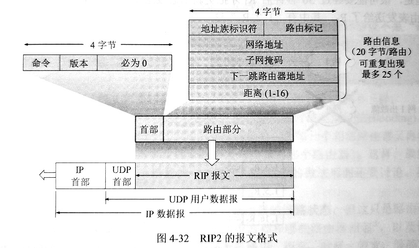

# 互联网的路由选择协议    

> 本节讨论几种常用的路由选择协议，也就是讨论路由表中的路由是怎样得出的。    

## 1、有关路由选择协议的几个基本概念    

### 理想的路由算法    

> 路由选择协议的核心就是路由算法，即需要什么算法来获得路由表中的各项目。    

- **一个理想路由算法的特点**：  

1. **正确和完整**。沿着各路由表所指引的路由，一定能到达目的主机。    
2. **简单**。路由选择的计算不应使网络通信量增加太多的额外开销。    
3. **自适应性(健壮性)**。适应通信量和网络拓扑的变化。    
4. **稳定性**。路由算法应收敛于一个可以接受的解，而不应该不停变化。    
5. **公平性**。路由选择算法应对于每个用户都是平等的。    
6. **最佳**。路由选择算法应当能找出最好的路由。最佳只能是相对于某一种特定要求下得出较为合理的选择而已。    

如果从路由算法能否随网络的通信量或拓扑自适应地进行调整变化来划分，则只有两大类：**静态路由选择策略**、**动态路由选择策略**。动态路由选择策略实现复杂开销大，适用于较复杂的大型网络。    


### 分层次的路由选择协议    

互联网采用的路由选择协议主要是自适应(动态)的、分布式路由选择协议。由于以下原因，互联网采用分层次的路由选择协议：  

1. 互联网规模非常大。如果让所有路由器都知道所有的网络应该怎样到达，则这种路由表将会非常大。而所有这些路由器之间交换路由信息所需带宽就会使通信链路饱和。    
2. 许多单位不愿意外界了解自己单位网络的布局细节和本部门所采用的路由选择协议，但是同时希望连到互联网上。    

为此，可以把整个互联网划分为许多较小的**自治系统(autonomous system, AS)**。自治系统AS是单一技术管理下的一组路由器，而这些路由器使用一种自治系统内部的路由选择协议和共同的度量。一个AS对于其他AS表现出的是一个单一的和一致的路由选择策略。    

在目前的互联网中，一个大的ISP就是一个自治系统。这样，互联网就把路由选择协议划分为两大类：    

1. **内部网关协议IGP(Interior Gateway Prorocol)**。即在一个自治系统内部使用的路由选择协议，而这与在互联网中的其他自治系统选用什么路由选择协议无关。目前这类路由选择协议使用得最多，如RIP和OSPF协议。    
2. **外部网关协议EGP(External Gateway Prorocol)**。如果源主机和目的主机不在同一个自治系统中(两个自治系统可能使用不同得内部网关协议)，当数据报传到一个自治系统的边界时，就需要一种协议将路由选择信息传递到另一个自治系统中。这样的协议就是外部网关协议EGP。目前使用最多得EGP是BGP-4。    


> 自治系统之间的路由选择又叫做*域间路由选择*，而在自治系统中得路由选择叫做*域内路由选择*。    

> 注意：最早的一个外部网关协议得协议名字正好也是EGP(RFC827)，被后来设计得一种更好的协议BGP所替代，旧协议EGP和新协议BGP都属于外部网关协议(EGP)这一类别。    

> 对于比较大得自治系统，还可将所有的网络再进行一次划分。例如可以构筑一个链路速率较高的主干网和许多速率低得区域网。      


<br />
<br />

## 2、内部网关协议RIP    

### Ⅰ-工作原理    

**RIP(Routing Infomation Protocol)** 是内部网关协议IGP中最先得到广泛使用的协议。RIP是一种分布式的基于距离向量得路由选择协议，是互联网的标准协议，最大优点是简单。    

RIP协议要求网络中每一个路由器都要维护从它自己到其他每一个目的网络得距离记录。    

RIP协议的“距离”又称为**跳数(hop count)**，因为每经过一个路由器，跳数就加一。      

RIP允许一条路径最多只能包含15个路由器，等于16时认为不可到达，所以RIP只适合小型互联网。    

**RIP不能在两个网络之间同时使用多条路由。RIP选择一条最少路由器的路由(即最短路由)，哪怕还存在另一条高速但路由器多的路由。**    

- **RIP协议的特点：**    

1. 仅和相邻路由器交换信息，不相邻的路由器不交换信息。    
2. 路由器交换的信息是当前路由器所知道的全部信息，即自己现在的路由表。    
3. 按固定的时间间隔交换路由信息。当网络拓扑发生变化时，路由器也及时向相邻路由器通告拓扑变化后的路由信息。    


**路由器再刚刚开始工作时，它的路由表是空的。然后路由器就得出到直接相连的几个网络的距离(这些距离定义为1).接着每个路由器也只和数目有限的相邻路由器交换并更新路由信息。但是经过若干次更新后，所有的路由器最终都会知道到达本自治系统中任何一个网络的最短距离和下一跳路由器地址。**    

> 在一般情况下，RIP协议可以收敛，并且过程也很快，“收敛”就是在自治系统中所有的节点都得到正确的路由选择信息的过程。    


### Ⅱ-距离向量算法    

对每一个相邻路由器发送过来的报文，进行以下步骤：  
1. 对地址为X的相邻路由器发来的RIP报文，先修改此报文中的所有项目：把“下一跳地址”字段中的地址都改为X，并把所有的“距离”字段都加1。    
```CPP
for(int i =0 ; i < 报文.项目.Length; i++)
{
    报文.项目[i].下一跳地址 = X;  
    报文.项目[i].距离 += 1;  
    //这是为了便于进行本路由表的更新。收到的项目中的“下一跳地址”对于本路由器是无意义的。    
}
```
2. 对修改后的RIP报文中的每一个项目，进行以下步骤：    
```CPP
if(原来的路由表中没有目的网络N)
{
    把该项目添加到路由表中; //表明这是新的网络。
}
else
{
    if(下一跳路由器地址是X) //CRE：应该是指原项目的下一跳地址  
    {
        把收到的项目替换原路由表中的项目;
        //因为这是最新的消息，要以最新的为准。
        //到达目的网络的距离可能增大或减小，也可能没有改变。  
    }
    else
    {
        if(收到的项目中的距离d小于路由表中的距离)
        {
            进行更新;
            //选择更短的距离。
        }
        else
        {
            //do nothing //距离更大或者不变都不更新。
        }
    }
}
```

3. 若3分钟还没有收到相邻路由的更新路由表，则把此相邻路由器记为不可到达的路由器，即把距离设置为`16`。    
4. 返回。    

> 上面给出的距离向量算法的基础就是Bellman-Ford算法。（CRE：X是A到B最短路径上的一点，那么A->X和X->B也都分别是A到X和X到B的最短路径）      

> RIP协议让一个自治系统中所有路由器都和自己的相邻路由器定期交换路由信息，并不断更新其路由表，使得从每个路由器到每个目的网络的路由都是最短的。      


### Ⅲ-RIP协议的报文格式    

> 目前较新的RIP版本是1998年11月公布的RIP2。RIP2可支持变长子网掩码和无分类域间路由选择CIDR。此外RIP2还提供简单的鉴别过程支持多播。    



> ⭕地址族标识符字段用来标识所使用的地址协议。    
> ⭕路由标记填入自治网络号ASN。这是考虑使RIP有可能收到本自治系统以外的路由选择信息。    
> ⭕一个RIP报文最多可以包括25个路由，因而RIP报文的最大长度是4+20*25=504字节。    
> ⭕RIP2有简单的鉴别功能，若使用鉴别功能，则将原第一个路由信息的位置用作鉴别。此时最多只能再放24个路由信息。    


- **RIP协议的优缺点：**    

RIP协议的最大优点就是实现简单，开销较小。    

RIP缺点也较多：  
1. RIP限制了网络规模，它能使用的最大距离为15。    
2. 路由器间交换的路由信息是完整路由表，开销较大。    
3. RIP存在的一个问题是：当网络故障时，要经过较长的时间才能将此信息传送给所有路由器，坏消息传播得很慢。    


<br />
<br />

## 3、内部网关协议OSPF    

### Ⅰ-基本特点    

*开放最短路径优先(Open Shortest Path First, OSPF)*，是为了克服RIP得缺点在1989年开发得。OSPF的原理很简单，但是实现较复杂。OSPF使用了Dijkstra最短路径优先算法。    

- **特征和要点**：  

OSPF最主要的特征就是使用分布式的**链路状态协议**，而不是像RIP那样的距离向量协议。OSPF的三个要点和RIP都不一样。    

1. 向本自治系统中所有路由器发送信息。    

> 这里使用的方法是*洪泛法(flooding)*，这就是路由器通过所有输出端口向所有相邻的路由器发送信息，而每一个相邻的路由器又再将此信息发往其所有的相邻路由器（除了刚刚发来信息的路由器）。    

2. 发送的信息就是与本路由器**相邻的所有路由器的链路状态**，但这只是路由器所知道的部分信息。“链路状态”表明本路由器和哪些路由器相连，以及该链路的“度量”(费用、时延、带宽等)信息。        

> RIP协议发送的信息是到所有网络的距离和下一跳路由器。    

3. 只有当链路状态发生变化时，才向所有路由器用泛洪法发送此信息。    

> RIP协议是不管网络拓扑有无变化，都要定期交换路由表信息。    

- **链路状态数据库同步**：    

由于各个路由器之间频繁地交换链路状态信息，因此所有的路由器最终都能建立一个**链路状态数据库**，这个数据库实际上就是**全网拓扑结构**。这个链路状态数据库在全网是同步的，因此每一个路由器使用链路状态数据库中的数据，构造出自己的路由表（例如使用Dijkstra的最短路径算法）。    

相比之下，RIP协议的每个路由器虽然知道到所有网络的距离以及下一跳路由，但是却不知道全网的拓扑结构。    

OSPF的链路状态数据库能较快地进行更新，使各个路由器能及时更新其路由表。OSPF的更新过程收敛得快是其重要优点。    


- **划分区域**：    

为了使OSPF能够用于规模很大的网络，OSPF将一个自治系统划分为更小的范围，称为*区域(area)*。    

划分区域的好处就是利用泛洪法交换链路状态信息的范围局限于每一个区域而不是整个自治系统，这就减少了整个网络通信量。    

在一个区域内部的路由器只知道本区域的完整网络拓扑，而不知道其他区域的网络拓扑情况。为了使每个区域能够和本区域外的区域进行通信，OSPF使用**层次结构的区域划分**。在上层的区域叫做**主干区域**，主干区域的作用是用来连通其他下层区域。从其他区域来的信息都由**区域边界路由器**进行概括。主干区域内还要有一个**自治系统边界路由器**专门和本自治系统外的其他自治系统交换路由信息。    

采用分层次划分区域的方法虽然增加了复杂度，但是使得每个区域内部交换路由信息的通信量大大减少，因而使OSPF能够用于规模很大的自治系统。    

- **直接使用IP数据报而非UDP**：    

OSPF不用UDP而是直接使用IP数据报进行传送(首部协议字段为89)。   

|IP数据报首部|OSPF分组首部|五种类型分组|
|-|-|-|

OSPF分组使用24字节的固定长度首部，分组的数据部分可以是五种类型分组中的一种。     

- **其他特点**：    

1. OSPF允许管理员给每条路由指派不同的代价。例如高带宽的卫星链路对于非实时业务可设置为较低代价，但对于时延敏感的业务就可设置为较高代价。因此OSPF对于不同类型业务可计算出不同的路由。    
2. 如果到同一个目的网络有多条相同代价的路径，那么可以将通信量分配给这几条路径。这叫做多路径间的*负载平衡*。    
3. 所有在OSPF路由器之间交换的分组都具有鉴别功能，因此保证了仅在可信赖的路由器之间交换链路状态信息。    
4. OSPF支持可变长度的子网划分和无分类编址CIDR。    
5. 由于网络中的链路状态可能经常发生变化，因此OSPF让每一个链路状态都带上一个32位序号，序号越大状态越新。      


### Ⅱ-OSPF的五种分组类型    

1. 类型1：**问候分组**。用来发现和维持相邻站的可到达性。    
2. 类型2：**数据库描述分组**。向邻站给出自己的链路状态数据库中所有链路状态项目的摘要信息。    
3. 类型3：**链路状态请求分组**。向对方请求发送某些链路状态项目的详细信息。    
4. 类型4：**链路状态更新分组**。用泛洪法对全网更新链路状态。这种分组是最复杂的，也是OSPF和核心部分。    
5. 类型5：**链路状态确认分组**。对链路更新分组的确认。    

> OSPF规定每两个相邻路由器每隔10秒就要交换一次问候分组，确保可到达。    

> OSPF让每个路由器用数据库描述分组和相邻路由器交换本数据库中已有的链路状态摘要信息。摘要信息主要就是指出有哪些路由器的链路状态信息(以及其序号)已经写入了数据库。经过与相邻路由器交换数据库描述分组后，路由器就使用链路状态请求分组，向对方请求发送自己所缺少的某些链路状态项目的详细信息。    


<br />
<br />


## 4、外部网关协议BGP    

> 1989年公布了新的外部网关协议--**边界网关协议BGP**。目前使用最多的是BGP-4。    

- **BGP的使用环境和内部网关协议不同主要有两个原因：**    

1. 互联网的规模太大，使得自治系统AS之间路由选择非常困难。    
2. 自治系统之间的路由选择必须考虑相关策略。    

> 由于上述情况，边界网关协议BGP只是能力求寻找一条能够到达目的网络并且**比较好**的路由，而并非要寻找一条最佳路由。    
> BGP采用了**路径向量(path vector)路由选择协议**，它与距离向量协议(如RIP)和链路状态协议(如OSPF)都有很大区别。    

- **BGP发言人：**    

在配置BGP时，每一个自治系统的管理员都要选择至少一个路由器作为该自治系统的“BGP发言人”。    
一般来说，两个BGP发言人都是通过同一个共享网络连接在一起的，而BGP发言人往往就是**BGP边界路由器**，但也可以不是BGP边界路由器。    

一个BGP发言人要与其他AS的BGP发言人要交换路由信息，就要先建立TCP连接(端口179)，然后在此连接上交换BGP报文以建立**BGP会话(session)**，利用BGP会话交换路由信息。    

使用TCP连接能提供可靠的服务，也简化了路由选择协议。使用TCP连接交换路由信息的两个BGP发言人彼此成为对方的**邻站(neighbor)**或**对等站(peer)**。    

> BGP协议交换路由信息的节点数量级是整个自治系统个数的量级，这要比这些自治系统中的网络数少很多。    

> BGP支持无分类域间路由选择CIDR，因此BGP的路由表也就应当包括目的网络前缀、下一跳路由、到达该目的网络所要经过的自治系统序列。    

> 在BGP刚刚运行时，BGP的邻站是交换整个的BGP路由表。但以后只需要在发生改变时更新有变化的部分，以减少开销。    

- **BGP-4的四种报文：**    

1. OPEN报文。用来和相邻的另一个BGP发言人建立关系，使通信初始化。    
2. UPDATE报文。同来通告某一路由的信息，以及列出要撤销的多条路由。    
3. KEEPALIVE报文。用来周期性地证实邻站的连通性。    
4. NOTIFICATION报文。用来发送检测到的差错。    


<br />
<br />

## 5、路由器的构成    

路由器是一种具有多个输入端口和多个输出端口的**专用计算机**，其任务就是转发分组。从路由器的某个输入端口接收到的分组，按照分组要去的目的网络，把该分组从路由器的某个合适的输出端口转发给下一跳路由器。    

整个路由器结构可以划分为**路由选择部分**和**分组转发部分**。    

- **路由选择部分：**    

路由选择部分也叫**控制部分**，其核心构件是路由选择处理机。路由选择处理机的任务是根据所选的路由选择协议构造出路由表，同时经常或定期地和相邻路由器交换路由信息而不断地更新维护路由表。    

- **分组转发部分：**    

分组转发部分由三部分构成：交换结构、一组输入端口、一组输出端口（端口就是硬件接口）。    

交换结构(switching fabric)又称为交换组成，它的作用就是根据转发表对分组进行处理，将某个输入端口进入的分组从一个合适的输出端口转发出去。交换接口可以看成是一个“路由器中的网络”。    

实现交换的方法有很多种，最常用的有：**通过存储器**、**通过总线**、**通过互连网络**。    


（END）    


