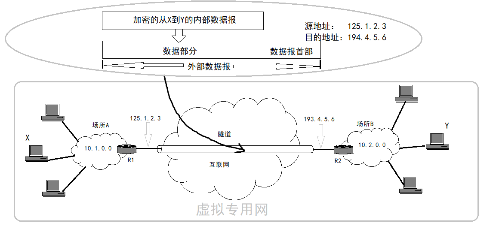

# 虚拟专用网VPN和网络地址转换NAT    

## 1、专用网和虚拟专用网    

- **专用互联网**：    

由于IP地址紧缺，一个机构能申请到的IP地址数往往远小于本机构所拥有的主机数。考虑到互联网并不安全，一个机构内也并不需要把所有主机接入外部互联网。    
假定在一个机构内部的计算机通信也是采用TCP/IP协议，那么从原则上讲，对于这些仅在内部使用的计算机就可以由本机构自行分配其IP地址。即使用仅在本地有效的本地地址，而不是申请全球地址。    

为了防止本地地址和互联网中某个IP地址重合产生歧义，RFC1918指明一些**专用地址(private address)**。这些地址仅能用于内部通信。互联网中所有路由器，对目的地址是专用地址的数据报一律不进行转发。    

RFC1918指明的一些专用地址：   
`10.0.0.0`~`10.255.255.255`(24位块)(本来是分配给ARPNET的，但是ARPNET已经停止运行了，所以就用作专用地址)    
`172.16.0.0`~`172.16.255.255`(20位块)    
`192.168.0.0`~`192.168.255.255`(16位块)    

采用这样的专用IP地址的互联网络称为**专用互联网**或者**本地互联网**。（简称**专网/私网**）    

- **虚拟专用网**：    

有时一个很大的机构的许多部门分布在世界各地，这些部门经常要交换信息，这可以有两种方法。一是租用电信公司的通信线路为本机构专用。二是利用公用互联网作为本机构各专用网之间的通信载体，这样的专用网称为虚拟专用网。    

> VPN只是在效果上和真正的专用网一样。    
> 如果专用网不同网点之间的通信必须经过公用的互联网，但又有保密的要求，那么所有通过互联网传送的数据就必须加密。    

  

> 由场所A和B的内部网络所构成的虚拟专用网VPN又称为*内联网VPN*。有时一个机构需要某些外部机构（通常是合作伙伴）参加进来，这样的VPN就称为*外联网VPN*。内联网和外联网都采用了互联网技术，即**都是基于TCP/IP协议的**。    

> 还有一种类型的VPN--**远程接入VPN**。外地员工的个人电脑接入互联网后，可以使用VPN软件与公司主机建立VPN隧道。因而外地员工与公司通信的内容也是保密的，就好像是使用公司内部的网络。     

 
 

## 2、网络地址转换NAT    

> 专用网内部的一些主机如果要想和互联网上的主机通信，除了再申请一些IP地址之外（不容易），最常用的方式是采用*网络地址转换(NAT)*。    

**网络地址转换(Network Address Translation)**方法在1994年提出。这种方法需要在专用网连接到互联网的路由器上安装NAT软件。装有NAT软件的路由器叫NAT路由器，他至少有一个有效的外部全球IP地址。所有使用本地地址的主机在和外界通信时，都要在NAT路由器上将其本地地址转换为全球IP地址才能和互联网连接。    

当NAT路由器拥有N个全球地址时，专用网上最多可以有N台主机接入到互联网。为了更有效地利用NAT路由器上的IP地址，现在常用的NAT转换表把运输层的**端口号**也利用上。这样，就可以使多个拥有本地地址的主机，共用一个NAT路由器上的全球IP地址。    

> 使用端口号的NAT也叫*网络地址与端口转换NAPT*，不使用端口号的NAT就叫做传统NAT。NAPT并不完全工作在网络层，因为端口属于运输层的范畴。  

> Zhihu：“**端口映射**”也属于NAT。分为动态端口映射和静态端口映射，动态端口映射其实就是NAT网关的工作方式。  

（END）    

