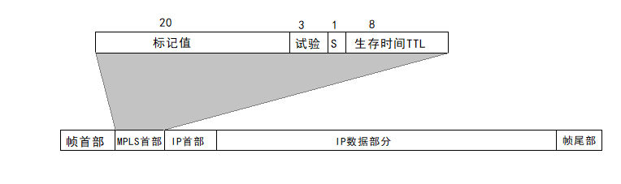

# 多协议标签交换MPLS（概述）    

> IETF于1997年成立了MPLS工作组，开发新协议-*MPLS(MultiProtocol Label Switching, 多协议标记交换)*。    
> 2001年MPLS成为互联网的建议标准。    

MPLS利用面向连接技术，使每个分组携带一个叫做**标签(Label)**的整数。当分组到达交换机时，交换机读取分组的标签，并用标签值来检索分组转发表。这样就比查找路由表来转发分组更快。    

MPLS具有以下三个方面的特点：1、支持面向连接的服务质量。2、支持流量工程，平衡网络负载。3、有效地支持虚拟专用网。    

## 1、MPLS基本工作原理    

在传统的IP网络中，分组每到达一个路由器，都必须查找路由表，并按照“最长前缀匹配”的原则找到下一跳IP地址。当网络很大时，查找含有大量项目的路由表要花费很多时间，在出现突发性通信量时，往往还会使缓存溢出，这就会引起分组丢失、时延增大和服务质量下降。    

MPLS的一个重要特点就是在MPLS域入口处，给每一个IP数据报打上固定长度标签，然后对打上标签的IP数据报用硬件进行转发，这就使得IP数据报转发过程大大加快了。采用硬件技术对打上标签的IP数据报进行转发就称为**标签交换**。        

MPLS可以使用多种链路层协议，如PPP、以太网、ATM、帧中继等。    

*MPLS域*是指该域中有许多彼此相邻的路由器，并且所有路由器都是支持MPLS技术的*标签交换路由器(LSR)*。LSR同时具有标签交换和路由选择这两个功能，标签交换功能是为了快速转发，但在此之前LSR需要使用路由选择功能构造转发表。    

 
 

## 2、MPLS首部的位置与格式    

    

---

> MPLS首部就处在链路层和网络层之间。    

> 在把加上了MPLS首部的IP数据报封装成以太网帧时，以太网的类型字段设置为`0x8847`(单播)、`0x8848`(多播)。    

---

（END）    