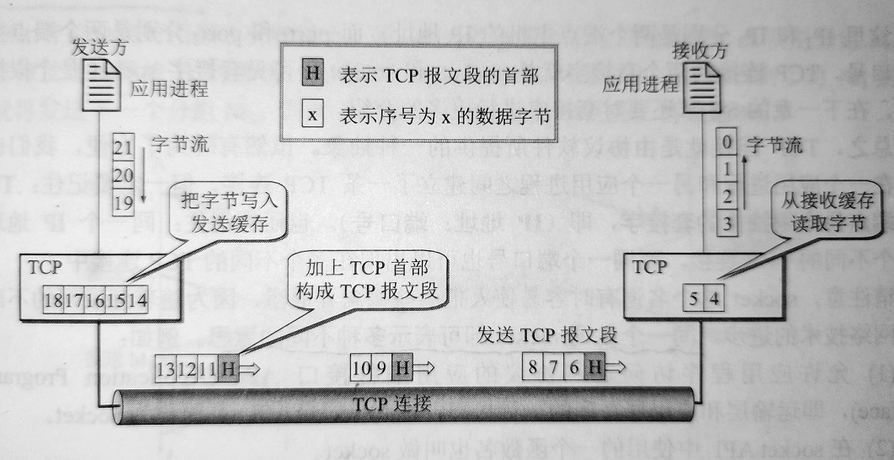

# 传输控制协议TCP概述    

## 1、TCP最主要特点    

> TCP是TCP/IP体系中非常复杂的一个协议。    

1. TCP是**面向连接的运输层协议**。应用程序在使用TCP协议之前必须先建立TCP连接，传输完成后必须释放TCP连接。    
2. **每条TCP连接只能由两个端点(endpoint)**。每一条TCP连接只能是**点对点**的。    
3. TCP提供**可靠交付**的服务。通过TCP连接传送的数据无差错、不丢失、不重复、按序到达。    
4. TCP提供**全双工通信**。TCP允许通信双方的应用进程在任何时候都能发送数据。TCP连接的两端都设有发送缓存和接收缓存。    
5. TCP**面向字节流**。TCP的“流”是指流入到进程或从进程流出的字节序列。“面向字节流”是指虽然应用程序和TCP的交互是一次一个数据块，但TCP把应用程序交下来的数据仅仅看成是一连串**无结构字节流**。    

- **缓存与字节流**：    

    

  

> TCP和UDP发送报文时采用的方式完全不一样。TCP并不关心应用进程一次把多长报文发送到TCP的缓存中，而是根据对方给出的窗口值和当前网络拥塞的程度来决定一个报文段应该包含多少字节（UDP发送的报文长度是应用进程给出的）。如果应用进程传送到TCP缓存的数据块太长，TCP就可以把它划分短一点再传送，如果应用进程一次只发来一个字节，TCP也可以等待积累有足够多字节后在构成报文段发送出去。    

 
 

## 2、TCP的连接    

> TCP把连接作为最基本的抽象。TCP的许多特性都与TCP是面向连接的这个基本特性有关。    

TCP连接的端点叫做**套接字(插口)(socket)**。RFC793定义是：端口号拼接到IP地址即构成了套接字，因此，套接字的表示方法是在IP地址后面写上端口号，中间用冒号或逗号隔开。    

（`套接字socket=(IP:端口号)`）        

每一条TCP连接唯一地被通信两端的两个端点(套接字)做确定。    

`TCP连接::={socket1, socket2}`    

### 关于“socket”的其他意思    

> 随着互联网的不断发展以及网络技术的进步，同一个名词"socket"却可以表示多种不同意思。    

1. 允许应用程序访问连网协议的API，即运输层和应用层之间的一种接口，称为socket API。    
2. 在socket API中使用的一个函数名也叫socket。    
3. 调用socket函数的端点称为socket，例如“创建一个数据报socket”。    
4. 调用socket函数时，返回值称为socket描述符，简称为socket。    
5. 在操作系统内核中连网协议的Berkeley实现，称为socket实现。    

(END)    