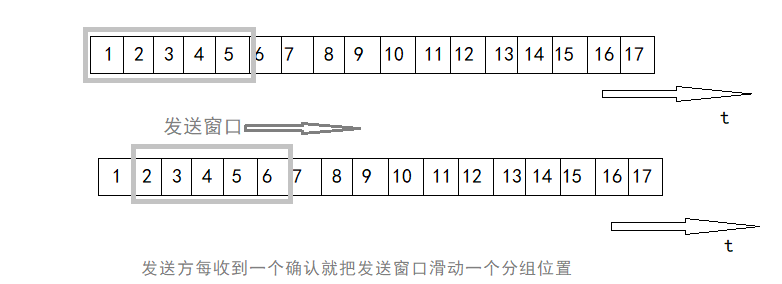

# 可靠传输的工作原理    

TCP下面的IP提供的是不可靠传输，所以TCP必须采用适当的措施才能使两个运输层之间的通信变得可靠。    

理想的传输条件有两个特点：1、传输信道不产生差错。2、不管发送方以多快的速度发送数据，接收方总是来得及处理收到的数据。在理想传输环境下不需要采取任何措施就能实现可靠传输，然后网络环境不是理想的，所以可以使用一些可靠传输协议。        

 
 

## 1、停止等待协议    

“停止等待”就是每发送完一个分组就停止发送，等待对方确认，在收到确认再发送下一个分组。    

### 出现差错    

当分组在传输过程中丢失了，或者接收端检测出差错丢弃了分组，这两种情况下接收端都不会发送任何信息。    
可靠传输协议是这样设计的：发送端只要超过一段时间仍然没有收到确认，就认为刚才发送的分组丢失了，因而重传前面发送过的分组，这就叫**超时重传**。    
要实现超时重传，就要在每发送完一个分组时设置一个**超时计时器**。计时器到期之前收到对方确认，就撤销已设置计时器。    

- 注意：  

1. 发送端发送一个分组后，必须暂时保留已发送分组的副本，收到确认后才能清除暂留的副本。    
2. 分组和确认分组都必须进行编号。这样才能明确是哪一个发送出去的分组收到了确认，而哪一个分组还没收到确认。    
3. 超时计时器设置的重传时间应当比数据在分组传输的平均往返时间更长一些。    

### 确认丢失和确认迟到    

如果接收端所发送的分组确认丢失或迟到了，收到了重传的分组，这时应该采取两个行动。    

1. 丢弃重复分组，不向上交付。    
2. 向A发送确认。    

> 使用上述的确认和重传机制，就可以在不可靠的传输网络上实现可靠的通信。像上述的这种可靠传输协议常称为**自动重传请求ARQ**，即重传的请求时自动的，接收方不需要请求发送方重传某个出错分组。    

### 信道利用率    

停止等待协议的优点是简单，但是缺点是信道利用率太低。    

> 为了提高传输效率，发送方可以不使用低效率的停止等待协议，而是采用流水线传输。流水线传输就是发送方连续发送多个分组，不必每发完一个分组就停止等待对方确认，这样可以让信道上一直有数据不间断地传输。当使用流水线传输时，就要使用*连续ARQ协议*和*滑动窗口协议*。    

 
 

## 2、连续ARQ协议    

    

  

接收方一般都是采用**累积确认**的方式，也就是说仅对按序到达的最后一个分组发送确认。表示到这个分组为止的所有分组都收到了。    

累积确认有优点也有缺点，优点是容易实现，即使确认丢失也不用重传。但缺点时不能向发送方反映出接收方已经正确收到所有分组的信息。例如发送方发送了前5个分组，而中间第3个分组丢失了，这时候接收方只能对前两个分组发出确认，发送方只能把后面三个分组都重传一遍，这叫做“**Go-Back-N**”。可见当通信线路质量不好时，连续ARQ协议会带来负面影响。    

（END）    