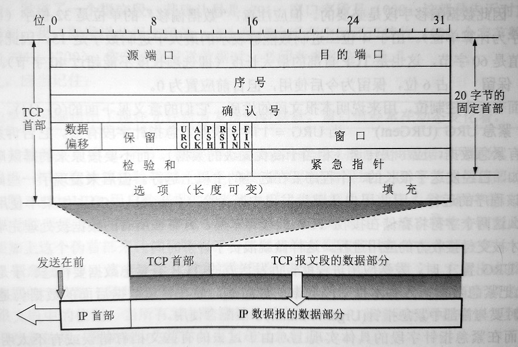

# TCP报文段首部格式    

TCP虽然是面向字节流的，但是TCP传送的数据单元仍然是报文段。一个TCP报文段也要分为首部和数据两个部分，而TCP的全部功能都体现在它首部中各字段的作用。    

TCP报文段首部前20字节是固定的，后面有4n字节是根据需要而增加的选项，所以TCP首部最小长度为20。    

    

- **源端口和目的端口**：    

各占2字节，分别写入源端口号和目的端口号，TCP和UDP一样也是通过端口号实现分用功能。    

- **序号**：    

占4字节，采用模运算。TCP是面向字节流的，**在一个TCP连接中传送的字节流中每一个字节都按顺序编号**。首部中的序号字段值则是本报文段所发送数据的第一个字节的序号。    

- **确认号**：    

占4字节。是接收端**期望收到对方下一个报文段的第一个数据字节的序号**。        

- **数据偏移**：    

占4位，单位是32位字。这个字段实际上是指出TCP报文段的首部长度。    

- **保留**：    

占6位。保留为今后所用，置0。    

- **紧急URG**：    

当URG为1时，表明紧急指针字段有效。它告诉系统此报文段有紧急数据需要尽快传送，而不要按原来的排队顺序传送。    

- **确认ACK**：  

仅当ACK等于1时确认号字段才有效，当ACK为0时，确认号无效。TCP规定在建立连接后所有传送的报文段都必须把ACK置1。    

- **推送PSH**：   

当两个应用进程进行交互式通信时，有时在一端的应用进程希望键入一个命令后立即就能收到对方响应。在这种情况下，TCP可以使用推送操作。发送方把PSH置1，并立即创建一个报文段发送出去。接收方收到PSH为1的报文段，就尽快地交付接收应用进程，而不必等待缓存填满后再向上交付。    

> 推送操作很少使用。    

- **复位RST**：    

当RST为1时，表明TCP连接中出现严重差错，必须释放连接，然后再重新建立连接。    
RST置1还用来拒绝一个非法报文段或拒绝打开一个连接。    

- **同步SYN**：  

在建立连接时用来同步序号。当SYN为1而ACK为0时，表明这是一个连接请求报文段。对方如果同意连接，则应在响应报文段中使SYN=1和ACK=1。    

- **终止FIN**：    

用来释放一个连接，当FIN为1时，表明此报文段的发送方的数据已发送完毕，并要求释放运输连接。    

- **窗口**：    

占2字节。窗口指的是发送本报文段的一方的接收窗口。窗口值告诉对方：从本报文段首部中的确认号算起，接收方目前允许对方发送的数据量。之所以要限制，是因为接收方的缓存空间是有限的。    

窗口值作为接收方让发送方设置其发送窗口的依据。    

- **检验和**：    

占2字节。检验和字段检验的范围包括首部和数据部分。和UDP一样，在计算检验和时，要加上伪首部。    

- **紧急指针**：    

占2字节。紧急指针仅在URG=1时有意义，它指出本报文段中的紧急数据的字节数（紧急数据结束后就是普通数据）。因此，紧急指针指出了紧急数据的末尾在报文段中的位置。        

> 即使窗口为零时也可以发送紧急数据。    

- **选项**：    

长度可变，最长可达40字节。TCP最初只规定了一种选项，即**最大报文段长度MSS**，MSS是每个TCP报文段中**数据字段的最大长度**。随着互联网发展，又增加了几个选项。如**窗口扩大选项**、**时间戳选项**等。    

（END）    

