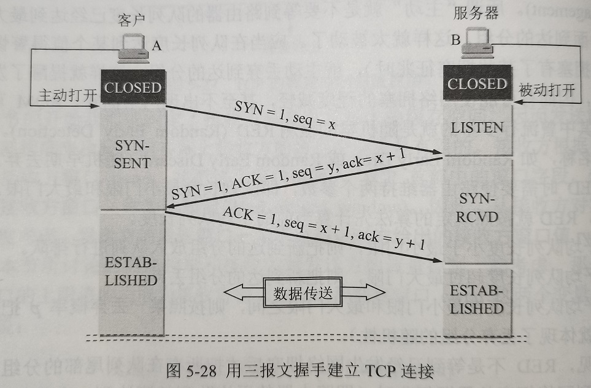
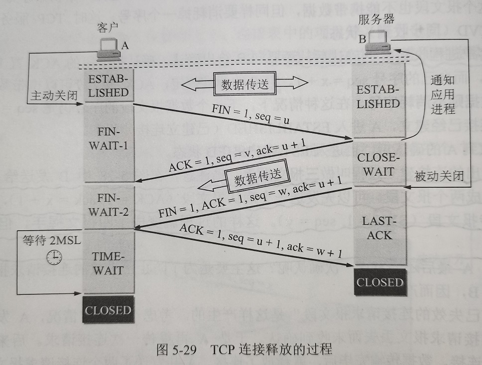
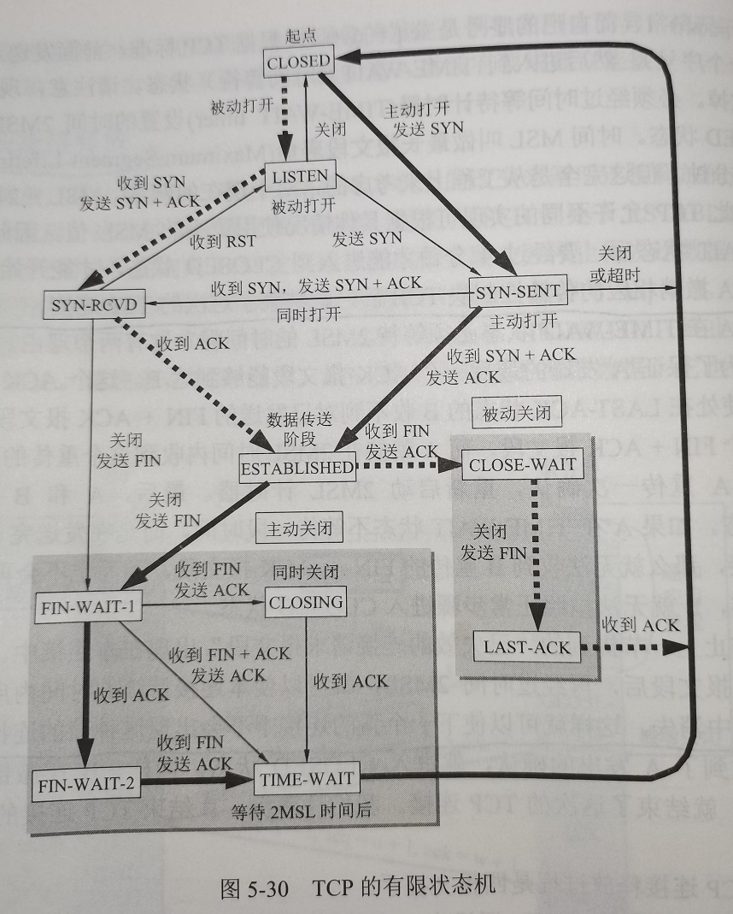

# TCP的运输连接管理    

运输连接三个阶段：**连接建立**、**数据传送**、**连接释放**。    

- 在TCP连接建立过程中要解决的三个问题：  

1. 要使每一方能够确知对方存在。    
2. 要允许双方协商一些参数。（如最大窗口值、是否使用一些选项等）    
3. 能够对运输实体资源（如缓存大小、连接表中的项目等）进行分配。    

- TCP的C/S架构：    

TCP连接的建立采用客户服务器方式。主动发起连接建立的应用进程叫做客户(client)，被动等待连接建立的应用进程叫做服务器(server)。    

 
 

## 1、TCP连接的建立    

TCP建立连接的过程叫做**握手**，握手需要在客户机和服务器之间交换三个TCP报文段。    

### 三报文握手的连接建立（三次握手）    

  

  

1. 最初客户端A和服务器B的TCP进程都处于`CLOSED`状态。    
2. B的TCP服务器进程先创建传输控制块TCB，准备接受客户端连接请求。然后服务器就处于`LISTEN`状态，等待客户端的连接请求。    
3. A的TCP客户端进程也是首先创建传输控制块TCB。然后在打算建立TCP连接时，向B发送连接请求报文，这时TCP进入`SYN-SENT`状态。（首部中的同步位SYN=1，同时选择一个初始序号seq=x。TCP规定SYN报文段不能携带数据但要消耗一个序号。）    
4. B收到连接请求报文段后，如同意建立连接，则向A发送确认，这时TCP服务器进程进入`SYN-RCVD`状态。（首部中的SYN和ACK都置1，确认号ack=x+1，同时也为自己选择一个初始号seq=y）    
5. TCP客户进程收到B的确认后，还要向B给出确认，A进入`ESTABLISHED`状态。（确认报文的ACK置1，确认号ack=y+1，而自己的序号seq=x+1。TCP标准规定ACK报文段可以携带数据，但如果不携带数据则不消耗序号，这种情况下，下一个报文段序号仍是seq=x+1。）    
6. 当B收到A的确认后，也进入`ESTABLISHED`状态。    

> 三报文握手常俗称为“三次握手”。    

### 四报文握手的连接建立    

B发送给A的报文段也可以拆分为两个报文段：确认报文段(ACK=1)和同步报文段(SYN=1)。这样的过程就变成了**四报文握手**，但是效果一样。    

### 最后一个确认报文的作用    

可能出现一种异常情况：即A发出的第一个连接请求报文段滞留了一段时间，以致延误到连接释放以后的某个时间段才到达B。让B误以为A要再次连接。    

这时如果不采用三次报文握手：B会单方面建立与A的连接，并一直等待A发来数据。    

 
 

## 2、TCP的连接释放    

### 四报文握手的连接释放（四次挥手）    

  

  

1. 数据传输结束后，双方都可释放连接。双方都处于`ESTABLISHED`状态。    
2. A的应用进程先向其TCP发出连接释放报文段，并停止发送数据，主动关闭TCP连接。    
3. A把连接释放报文段首部的终止控制位FIN置1，序号seq=u（等于已传送数据最后一个字节序号加一）。这时A进入`FIN-WAIT-1`状态等待B的确认。    
4. B收到连接释放报文段后即发出确认，确认号ack=u+1，这个报文段的序号seq=v（等于B已传送数据最后一个字节序号加一）。然后B进入`CLOSED-WAIT`状态。    
5. TCP服务器进程这时候通知高层应用进程，因而从A到B这个方向的连接就释放了，这时的TCP处于“半关闭”状态，即A已经没有数据要发送了，但B向A发送数据A仍要接收，这个状态可能持续一段时间。     
6. A收到来自B的确认后，就进入`FIN-WAIT-2`状态，等待B发出的连接释放报文段。    
7. 如果B已经没有要向A发送的数据，其应用进程就通知TCP释放连接。这时B发出的连接释放报文必须使FIN置1，假定序号seq=w，并重复上次的确认号ack=u+1。这时B进入`LAST-ACK`状态，等待A的确认。    
8. A在收到B的连接释放报文后，必须对此发出确认。在确认报文段把ACK置1，确认号ack=w+1，序号seq=u+1（TCP规定FIN报文消耗一个序号）。然后进入`TIME-WAIT`状态。最后还必须经过*时间等待计时器*设置的时间2MSL后，A才进入`CLOSED`状态，撤销TCB，结束TCP连接。    
9. B只要收到了A发出的确认，就进入`CLOSED`状态。撤销TCB，结束TCP连接。    

### **关于时间等待计时器(TIME-WAIT timer)的MSL**    

MSL叫做*最长报文段寿命(Maximum Segment Lifetime)*，RFC建议设为2分钟。对于现在的网络，2分钟可能太长，因此TCP允许不同的实现可根据具体情况使用更小的MSL。    

### **为什么A在`TIME-WAIT`状态必须等待2MSL时间**    

1. 为了保证A发送的最后一个ACK报文段能够到达B。这个ACK报文段可能会丢失，因而使处在`LAST-ACK`状态的B收不到确认。B会重传FIN+ACK报文段，而A就能在2MSL时间内收到这个重传的FIN+ACK报文段，接着A重传一次确认，重新启动2MSL计时器。最后A和B都能进入`CLOSED`状态。    
2. 确保本连接产生的所有报文段都从网络中消失，下一个新连接中不会出现旧连接的报文段。    

### **保活计时器(keepalive timer)**    

如果客户端突然出现故障，服务器再也不能收到客户发来的数据。为了防止服务器一直等待下去，可以使用保活计时器。服务器每收到一个客户数据，就重置计时器，时间通常是两小时。如果两小时没有收到客户端数据，服务器就每隔75秒持续发送10次探测报文段，如果仍无响应，服务器就认为客户端出故障，然后关闭连接。    

 
 

## 3、TCP的有限状态机    

  

(END)  