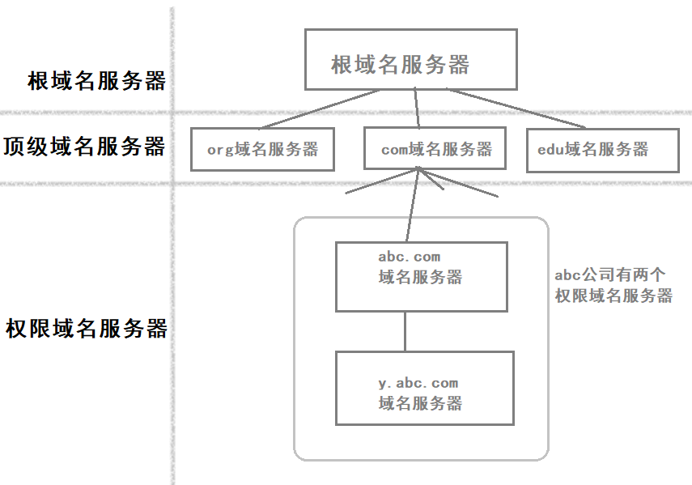

# 域名系统DNS    

## 1、域名系统概述    

*域名系统(Domain Name System)*是互联网使用的命名系统，用来把便于人们使用的机器名字转换为IP地址。    

- **使用DNS的原因**：    

用户与互联网上某台主机通信时，必须要知道对方的IP地址。然而IP地址不容易记忆。但在应用层为了便于用户记忆各种网络应用，连接在互联网上的主机不仅有IP地址，而且还有便于用户记忆的主机名字。域名系统DNS能把互联网上的主机名转换为IP地址。    

- **hosts文件**：    

早在ARPANET时代，整个互联网上只有数百台计算机，那时使用一个叫做hosts的文件，列出所有主机名字和相应的IP地址。只要用户输入一台主机名字，计算机就可以很快地把这台主机名字转换成机器能识别的IP地址。    

> CRE：Windows系统中hosts文件优先级高于DNS。    

- **分布式**：    

从理论上讲，整个互联网可以只使用一个域名服务器，使它装入互联网上所有的主机名，并回答所有对IP地址的查询。然而这种做法不可取，因为互联网规模很大，这样的域名服务器肯定会因为过负荷而无法正常工作，一旦域名服务器出现故障，整个互联网就会瘫痪。因此早在1983年互联网就采用**层次树状结构的命名方法**，并使用**分布式的域名系统**。DNS的互联网标准是RFC1034,1035。    

互联网的域名系统被设计成一个联机分布式数据库系统，并采用客户服务器方式。DNS使大多数名字都在本地进行**解析(resolve)**，仅少量解析需要在互联网上通信，因此DNS系统的效率非常高。由于DNS是分布式系统，即使是单个计算机故障，也不会影响整个DNS系统正常运行。    

- **域名服务器**：    

域名到IP地址的解析是由分布在互联网上的许多**域名服务器程序(简称域名服务器)**共同完成的。域名服务器程序在专设的节点上运行，而人们也常把运行域名服务器程序的机器称为域名服务器。    

- **域名解析要点**：    

当某一个应用进程需要把主机名解析为IP地址时，该应用进程就调用**解析程序(resolver)**，并成为DNS的一个客户，把待解析的域名放在DNS请求报文中，以UDP方式发给本地域名服务器。本地域名服务器在查找域名后，把对应的IP地址放在回答报文中返回。应用进程获得目的主机IP地址后即可开始通信。    

若本地域名服务器不能回答该请求，则该域名服务器就暂时成为DNS中另一个客户，并向其他域名服务器发出查询请求。这种过程直至找到能回答该请求的域名服务器为止。    

 
 

## 2、互联网的域名结构    

> 早期互联网采用了不分级的简短名字，但是后来用户数急剧增加，互联网就采用了层次树状结构的命名方法。    

### **域名**    

任何一个连接在互联网上的主机或者路由器，都有一个唯一的层次结构的名字，即**域名(domain)**。*域(domian)*是名字空间中一个可被管理的划分，域还可划分子域，而子域也可以继续划分，这样就形成了**顶级域**、**二级域**、**三级域**，等等。    

|www|google|com|
|-|-|-|
|三级域名|二级域名|顶级域名|

> 每一个域名都由*标签(label)*序列组成，各标签之间用点隔开。    
> 每一个标签不超过63字符，不区分大小写。完整域名不超过255字符。    
> 不规定下级域名的划分，各级域名由其上一级域名管理机构管理。而顶级域名由ICANN进行管理。    

### **顶级域名分类**    

顶级域名(Top Level Domain)可以分为三大类：    

1. 国家顶级域名nTLD。(cn、uk、us等)    
2. 通用顶级域名gTLD。(com公司企业、net网络服务机构、org非营利组织)    
3. 基础结构域名。这种顶级域名只有一个，即arpa，用于反向域名解析，称为反向域名。    

   
   

## 3、域名服务器    

> 域名体系是抽象的，具体实现域名系统则是使用分布在各地的域名服务器。    

如果每一级的域名都有一个相应的域名服务器，使所有域名服务器构成“域名服务器表树”的结构，那么会使域名服务器的数量太多，运行效率降低。因此DNS采用划分*区(zone)*的方法来解决这个问题。    

一个服务器所负责管辖的范围叫做**区(zone)**。各单位根据具体情况来划分自己管辖的区。但在一个区内的所有节点必须是能够连通的。每一个区设置相应的**权限域名服务器(authoritative name server)**，用来保存该区中所有主机的域名到IP地址的映射。总之，“区”是DNS服务器的实际管辖范围。区可能小于或等于域，但是一定不能大于域。    

  

### 域名服务器分类    

- **根域名服务器(root name server)**：    

根域名服务器是最高层次的域名服务器，也是最重要的域名服务器。不管哪一个本地域名服务器，若要对互联网上任意一个域名进行解析，只要自己无法解析，就首先求助于根域名服务器。    

> 假如所有域名服务器都瘫痪了，那么整个互联网中的DNS系统就无法工作。    
> 2016年，全世界已经在500多个地点安装了根域名服务器。但是它们只使用13个不同IP地址的域名，即`a.rootserver.net`~`m.rootserver.net`。    
> 为了提供更可靠的服务，在每一个地点的根域名服务器往往由多台机器组成。为了安全起见，有些根域名服务器的具体地点还是保密的。    

现在世界上大部分DNS域名服务器，都能就近找到一个根域名服务器查询IP地址。      

- **顶级域名服务器(TLD服务器)**：    

这些域名服务器负责管理在该顶级域名服务器注册的所有二级域名。当收到DNS查询请求时，就给出相应的回答（最后的结果或者下一步应当找的域名服务器的IP地址）。    

- **权限域名服务器**：    

负责一个“区”的的域名服务器。当一个权限域名服务器还不能给出最后的查询回答时，就会告诉发出查询请求的DNS客户，下一步应该找哪一个权限域名服务器。    

- **本地域名服务器(local name server)**：    

本地域名服务器并不属于上图的域名服务器结构层次，但是他对域名系统非常重要。当一台主机发出查询DNS请求时，这个查询请求报文就发送给本地域名服务器。    

每一个互联网服务提供者ISP、或者一个大学都可以拥有一个本地域名服务器，这种域名服务器有时又称为**默认域名路由器**。    

> Windows系统可以设置首选DNS服务器和备用DNS服务器。这里的DNS服务器指的就是本地域名服务器。    
> 本地域名服务器离用户较近，一般不超过几个路由器的距离。    

### 主/辅域名服务器    

为了提高域名服务器可靠性，DNS域名服务器都把数据复制到几个域名服务器来保存，其中的一个是**主域名服务器**，其他的是**辅域名服务器**。当主域名服务器故障时，辅助域名服务器可以保证DNS的查询工作不会中断。主域名服务器定期把数据复制到辅助域名服务器，而更改数据只能在主域名服务器中进行。这样就保证了数据一致性。    

### 域名解析过程    

第一，主机向本地域名服务器查询一般都使用**递归查询(recursive query)**。所谓的递归查询是指：如果主角所询问的本地域名服务器不知道被查询域名的IP地址，那么本地域名服务器就作为DNS客户向其他根域名服务器继续发出查询请求报文，而不是让该主机自己进行下一步查询。     

第二，本地域名服务器向根域名服务器的查询通常采用**迭代查询(iterative query)**。迭代查询是指：当根域名服务器收到本地域名服务器发出的迭代查询请求报文时，要么给出所要查询的IP地址，要么告诉本地域名服务器下一步应当向哪一个域名服务器进行查询，然后让本地域名服务器进行后续的查询(而不是代替它查询)。      
根域名服务器通常是把自己知道的顶级域名服务器的IP地址告诉本地域名服务器，让本地域名服务器再向顶级域名服务器查询。顶级域名服务器收到本地域名服务器的查询请求后，要么给出所要查询的IP地址，要么告诉本地域名服务器下一步应当向哪一个权限域名服务器进行查询，本地域名服务器就这样进行迭代查询。    

（END）    