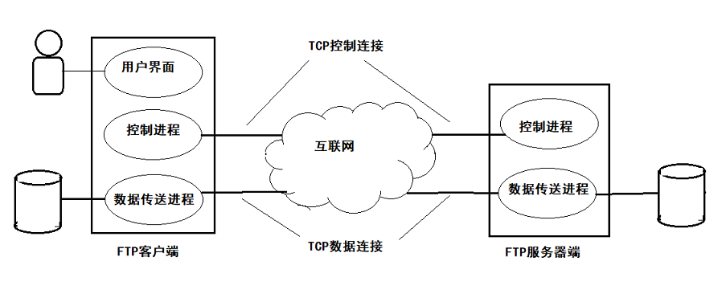

# 文件传输协议    

## 1、FTP概述    

*文件传输协议(File Transfer Protocol, FTP)*是互联网上使用得最广泛得文件传输协议。FTP提供交互式得访问，允许客户指明文件得类型与格式，并允许文件具有存取权限。FTP屏蔽了各计算机系统得细节，因而适合于在异构网络中任意计算机之间传送文件。    

> 互联网发展的早期阶段，用FTP传送文件约占整个互联网通信量得三分之一，而由电子邮件和域名系统所产生得通信量还小于FTP所产生得通信量，到了1995年，WWW的通信量才首次超过FTP。    

### 文件共享协议的两大类    

- Ⅰ、复制整个文件    

> 基于TCP的FTP和基于UDP和TFTP都是文件共享协议中的一大类。    

> 如果要存取一个文件，就必须先获得一个本地的文件副本，如果要修改文件，只能对文件的副本进行修改，然后再将修改后的文件副本传回原节点。    

- Ⅱ、联机访问    

> 允许多个程序同时对一个文件进行存取。和数据库系统的不同之处是用户不需要调用一个特殊的客户进程，而是由操作系统提供对远地共享文件进行访问的服务，就如同对本地文件的访问一样。    

> 这就使用户可以用远地文件作为输入输出来运行任何应用程序，而操作系统中的文件系统则提供对共享文件的*透明存取*。透明存取的优点是：将原来的用于处理本地文件的应用程序用来处理远地文件时，不需要进行明显改动。    

 
 

## 2、FTP基本工作原理    

### 两台主机之间传送文件的一些问题  

1. 计算机存储数据的格式不同。    
2. 文件的目录结构和文件命名规定不同。    
3. 对于相同的文件存取功能，操作系统使用的命令不同。    
4. 访问控制方法不同。    

FTP只提供文件传送的一些基本服务，它使用TCP可靠的运输服务。FTP的主要功能是减少或消除不同操作系统下处理文件的不兼容性。    

FTP使用客户/服务器方式。一个FTP服务器进程可同时为多个客户进程提供服务。    

FTP的服务器进程由两大部分构成：一个**主进程**，负责接收新的请求；另外有若干个**从属进程**，负责处理单个请求。    

### 主进程的工作步骤    

1. 打开熟知端口号21，使客户进程能够连接上。    
2. 等待客户进程发出连接请求。    
3. 启动从属进程处理客户进程发来的请求。从属进程对客户进程的请求处理完毕后即终止，但从属进程在运行期间根据需要还可能创建其他一些子进程。    
4. 回到等待状态，继续接受其他请求。主进程和从属进程是并发的。    

### FTP的工作情况    

  

  

> 服务器有两个从属进程：控制进程和数据传送进程。简单起见，没有画出服务器的主进程。    
> 客户端除了控制进程和数据传送进程外，还有一个用户界面进程。    

在进行文件传输时，FTP的客户端和服务器之间要建立两个并行的TCP连接：“控制连接”和“数据连接”。控制连接在整个会话期间一直保持打开，FTP客户所发出的传送请求，通过控制连接发送给服务器端的控制进程，但是控制连接不传送文件。实际传送文件的是数据连接。    

服务器端的控制进程在接收到FTP客户发送来的文件传输请求后就要创建“数据传送进程”和“数据连接”，用来连接客户端和服务器端的数据传送进程。数据传送进程实际完成文件传送，传送完毕后关闭“数据传送进程”并结束运行。    

由于FTP使用了一个分离的控制连接，因此FTP的控制信息是"out of band"传送的。    

当客户进程向服务器进程发出建立连接请求时，要寻找连接服务器进程的熟知端口号21，同时还要告诉服务器进程自己的另一个端口号码，用于建立数据传送连接。接着服务器进程用自己传送数据的熟知端口20与客户进程所提供的端口号建立数据传送连接。    

使用两个独立连接的主要好处是使协议更加简单和更容易实现，同时在传输文件时还可以利用控制连接对文件传输进行控制，例如请求终止传输。    

### FTP的局限    

FTP并非对所有数据传输都是最佳的。例如计算机A上运行的应用程序要在远地计算机B的一个很大的文件末尾添加信息，如果使用FTP，则应先将此文件从计算机B传送到计算机A，添加信息后再用FTP传送到计算机B，很花费时间并且没必要。    

然而**网络文件系统NFS**采用另一种思路。**NFS允许应用进程打开一个远地文件，并能在该文件的某一个特定位置开始读写数据**。这样NFS可使用户只复制一个大文件中的小片段，而不需要复制整个文件。    

> 对于上述例子，计算机A中的NFS客户软件，把要添加的数据和文件后面写数据的请求一起发送到远地计算机B中的NFS服务器，NFS服务器更新文件后返回应答信息。**在网络上传送的只是少量的修改数据**。    

 
 

## 3、简单文件传输协议TFTP    

*简单文件传输协议(Trivial File Transfer Protocol, TFTP)*是一个很小但是易于实现的文件传送协议。    

TFTP使用UDP数据报，因此TFTP需要有自己的差错改正措施。    

TFTP只支持文件传输而不支持交互。TFTP没有一个庞大的命令集，没有列目录的功能，也不能对用户进行身份鉴别。    

- TFTP的优点：    

1. 可用于UDP环境。    
2. TFTP代码所占内存较小。    

- TFTP的特点：    

1. 每次传送的数据报文中有512字节的数据，但最后一次可以不足512字节。（如果刚好512字节需要传一个只含首部的报文作为结束标志）    
2. 数据报文按序编号，从1开始。    
3. 支持ASCII码和二进制码。    
4. 可对文件进行读和写。    
5. 使用很简单的首部。    

> TFTP的工作方式很像*停止等待协议*。发送完一个文件快后就等待对方的确认，确认时应指明所确认的块编号。发完数据后在规定时间内收不到确认就要重新发数据PDU。发送确认PDU的一方若是在规定时间内收不到下一个文件块，也要重发确认PDU。这样就可以保证文件传送不致因某一个数据报的丢失而告失败。    

（END）    