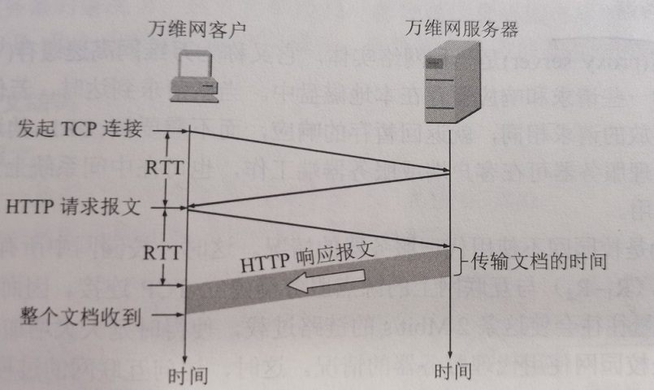
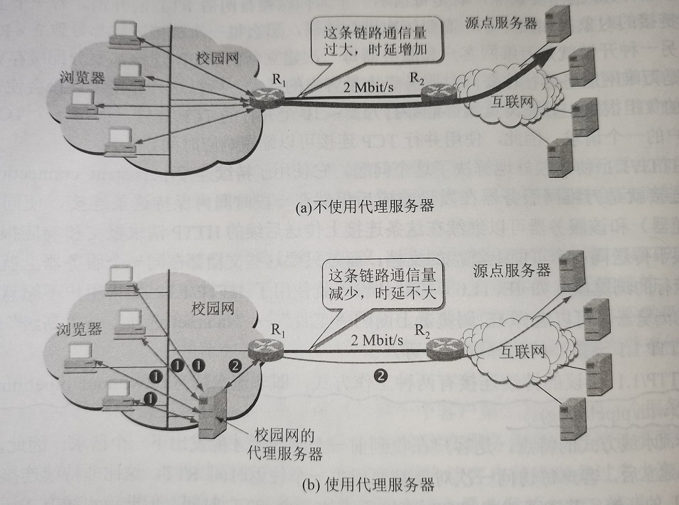
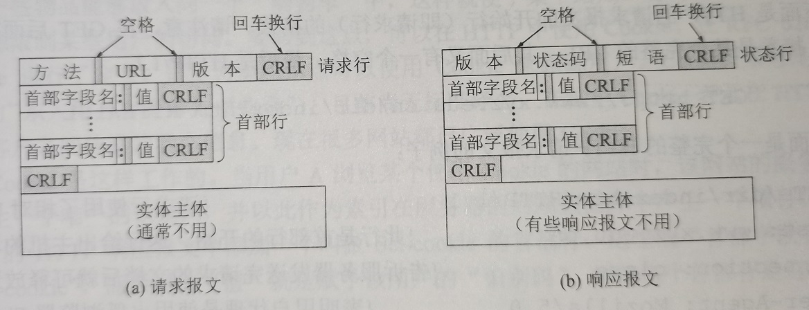

# 第二部分：HTTP和万维网文档以及HTML    


# 3、超文本传输协议HTTP    

### Ⅰ、HTTP的操作过程    

HTTP协议定义了浏览器怎样向万维网服务器请求万维网文档，以及服务器怎样把文档传送给浏览器。从层次结构上看，HTTP是**面向事务**的应用层协议，它是万维网上能够可靠交换文件的重要基础。HTTP不仅传送完成超文本跳转所必需的信息，而且也传送任何可从互联网上的得到的信息，例如文本、超文本、声音、图像等。    

- **服务器和客户端的交互**：    

每个WWW网点都有一个服务器进程，它不断地监听TCP的端口80，以便发现是否有浏览器(WWW客户)向他发出连接建立请求。一旦监听到连接建立请求并建立了TCP连接后，浏览器就向万维网服务器发出浏览某个页面的请求，服务器接着就返回所请求的页面作为响应。最后，TCP连接释放。

在浏览器和服务器之间的请求和响应的交互，必须按照规定的格式和遵循一定的规则，这些格式和规则就是超文本传输协议HTTP。    

HTTP规定在HTTP客户和HTTP服务器之间每次交互，都由一个ASCII码串构成的请求和一个类似的通用互联网扩充，即“类MIME”的响应组成。HTTP报文通常都使用TCP连接传送。    

用户浏览页面的方法有两种，一种方法是在浏览器的地址窗口键入所要查找的页面的URL。另一种方法是在某一个页面中点击一个可选部分，这时浏览器会自动在互联网上找到所要链接的页面。    


- **无连接、无状态**：    

HTTP使用了面向连接的TCP作为运输层协议，保证了数据的可靠传输。HTTP不必考虑数据在传输过程中被丢弃后又怎样被重传。但是HTTP协议本身是无连接的。这就是说虽然HTTP使用了TCP连接，但通信的双方在交换HTTP报文之前不需要先建立HTTP连接。    

HTTP协议是**无状态(stateless)**的。也就是说同一个客户第二次访问同一个服务器上的页面时，服务器的响应与第一次访问时候相同。因为服务器并不记得这个用户，也不记得为该客户曾经服务过多少次。HTTP的无状态特性简化了服务器的设计，使服务器更容易支持大量并发的HTTP请求。    

- **TCP、RTT**：    

用户点击链接某个WWW文档时，HTTP协议首先要和服务器建立TCP连接。这里需要三报文握手。当建立TCP连接的三报文握手的前两部分完成后(即经过一个RTT时间)，WWW客户就把HTTP请求报文，作为建立TCP连接的三报文握手中的第三个报文的数据，发送给WWW服务器。服务器收到请求后，就把所请求的文档作为响应报文返回给客户。    

<hr />  
    
<hr />  


- **持续连接**：    

HTTP/1.0的主要缺点，就是每请求一个文档就要有两倍RTT的开销。若一个主页上有很多链接的对象（例如图片等）需要依次进行链接，那么每一次的链接下载都导致了2XRTT的开销。另一种开销就是WWW客户和WWW服务器每一次建立新的TCP连接都要分配缓存和变量，特别是WWW服务器往往需要同时服务于大量客户的请求，所以这种**非持续连接**会使WWW服务器负担很重。好在浏览器都能够打开5-10个并行的TCP连接，每个TCP连接处理客户的一个请求。        

HTTP/1.1协议较好地解决了这个问题，它使用**持续连接**。持续连接就是WWW服务器在发送响应后仍然在一段时间内保持这条连接，使同一个客户浏览器和该服务器可以继续在这条连接上传送后续的HTTP请求报文和响应报文。这并不局限于传送同一个页面上链接的文档，而是只要这些文档都在同一个服务器上就行。    

- **HTTP/1.1持续连接的两种工作方式**：    

**非流水线方式**：客户在收到前一个响应后才能发出下一个请求。因此在TCP连接已建立后，客户每访问一次对象都要用去一个RTT。这比非持续连接节省了一个建立TCP连接所需的RTT。非流水线方式仍有缺点，TCP连接空闲状态浪费了服务器资源。    

**流水线方式**：客户收到HTTP响应报文之前就能接着发送新的请求报文。于是一个接一个的请求报文到达服务器后，服务器就可连续地发回响应报文。因此使用流水线方式时，客户访问所有对象只需花费一个RTT时间。    


### Ⅱ、代理服务器    

*代理服务器(Proxy Server)*是一种网络实体，又称为*万维网高速缓存(Web Cache)*。    

代理服务器把最近的一些请求和响应暂存在本地磁盘中。当新请求到达时，若代理服务器发现这个请求与暂存的请求相同，就返回暂存的响应，而不需要按URL的地址再去互联网访问该资源。    

代理服务器可在客户端或者服务器端工作，也可以在中间系统上工作。    


    
<hr />  

> 代理服务器有时作为服务器（当接受浏览器得HTTP请求时），有时作为客户（当向互联网上的源点服务器发送HTTP请求时）。　　　　


### Ⅲ、HTTP的报文结构    

#### **HTTP的两类报文**  

1. 请求报文 -- 从客户向服务器发送的报文。  
2. 响应报文 -- 从服务器向客户发送的报文。    

    
<hr />  

由于HTTP是**面向文本(text oriented)**的，因此在报文中的每一个字段都是一些ASCII码串。因而**各个字段的长度都是不确定的**。    

HTTP请求报文和响应报文都是有三个部分组成的。可以看出，这两种报文格式的区别就是开始行不同。    


**开始行(请求行/状态行)**：用于区分是请求报文还是响应报文。在请求报文中的开始叫做*请求行(request-line)*，而在响应报文中的开始行叫做*状态行(status-line*。    

**首部行**：用来说明浏览器、服务器或者报文主体的一些信息。首部可以有好几行，但也可以不使用。    

**实体主体(entity body)**：在请求报文中一般不使用这个字段，而在请求报文中也可能没有这个字段。    


#### **HTTP请求报文的一些特点**  

请求报文的“请求行”只有三个内容：**方法**、**资源URL**、**HTTP版本**。    

◉ 方法：  

|方法|意义|
|-|-|
|OPTION|请求一些选项的信息|
|GET|请求读取由URL所标志的信息|
|HEAD|请求读取由URL所标志的信息的首部|
|POST|给服务器添加信息|
|PUT|在指明的URL下存储一个文档|
|DELETE|删除指明的URL所标志的资源|
|TRACE|用来进行环回测试的请求报文|
|CONNECT|用于代理服务器|

◉ 请求报文示例：  

```
GET /dir/index.htm HTTP/1.1     //请求行使用了相对URL  
Host: www.example.com           //此行是首部行的开始  
Connection: close               //告诉服务器发送完请求的文档后就可释放连接(不使用持续连接)    
User-Agent: Mozilla/5.0         //表明用户代理是使用火狐浏览器  
Accept-Language: cn             //表明用户希望优先得到中文版本的文档  
                                //请求报文的最后还有一个空行    
```

#### **HTTP响应报文的特点**    

响应报文的状态行包含三项内容：**HTTP版本**、**状态码**、**解释状态码的简单短语**。    

◉ 状态码：    

|状态码大类|含义|    
|-|-|
|1xx|通知信息，如收到了或正在进行处理|
|2xx|表示成功|
|3xx|重定向|
|4xx|客户差错|
|5xx|服务器差错|

|常见状态码|含义|
|-|-|
|202|接受|
|301|永久转移了|
|404|错误请求|
|404|找不到|


◉ 响应报文示例(重定向)：  

```
HTTP/1.1 301 Moved Permanently                  //永久转移了  
Location: http://www.newurl.com/index.html      //新的URL
```  


### Ⅳ、用户状态存储    

> CRE：HTTP是无状态的，要实现用户状态(登录信息等)的存储可以使用Cookie和Session。    

> 服务器可以在响应报文中使用"Set-cookie"首部行。浏览器可以在请求报文中使用"Cookie"首部行。    


<br />  
<br />  
<br />  
<br />  


## 4、万维网的文档    

### Ⅰ、超文本标记语言HTML    

要使任何一台计算机都能显示出任何一个万维网服务器上的页面，就必须**解决页面制作的标准化问题**。    

*超文本标记语言(hypertext markup language, HTML)*就是一种制作万维网页面的标准语言，他消除了不同计算机之间信息交流的障碍。    

> HTML并不是应用层协议，他只是万维网浏览器使用的一种语言。    

> 官方的HTML标准由万维网联盟W3C负责制定，最新版本是HTML5，新的版本支持网页中嵌入音视频以及交互式文档等功能。    


- ⚪**标签(TAG)**：  

HTML定义了许多用于排版的命令，即“标签(tag)”。标签以"<...>"开头，以"</...>"结尾。    

并非所有浏览器都支持所有的标签。如果浏览器不支持某个HTML标签，则浏览器就会忽略该标签。    


- ⚪**图像/链接**：    

HTML允许在WWW页面中插入图像。一个页面本身带有的图像称为**内含图像(inline-image)**。HTML没有规定该图像的格式。实际上大多数浏览器都支持`gif`和`jpeg`文件。    

HTML还规定了链接的设置方法。每个链接都有一个起点和一个终点。    

链接的起点可以是一段文字或者一张图片。    

链接的终点可以是其他网站上的页面。这种链接方式叫做**远程链接**。有时链接可以指向本计算机中的某一个文件或本文件中的某处，这叫做**本地链接**。    


- ⚪**其他几种相关语言**：    

**XML**:可扩展标记语言(Extensible Markup Language)和HTML很相似。但是XML的设计宗旨是传输数据，而不是显示数据（HTML是为了在浏览器显示数据）。    
> CRE：XML不仅用于传输数据，还可以用于保存数据。XML文档具有结构性，用户根据需要自定义，并且平台无关。     


**XHTML**：可扩展超文本标记语言XHTML，是更严格的HTML版本。    
> CRE：XHTML因为一些原因已经不怎么受欢迎了，目前最有前景的还是HTML5。    

**CSS**：层叠样式表(Cascading Style Sheet)是一种样式表语言，用于为HTML文档定义布局。    


### Ⅱ、动态WWW文档    

前面所讨论的WWW文档都是最基本的**静态文档(static document)**。静态文档在文档创作完毕后就存放在WWW服务器中，在被用户浏览的过程中内容不会改变。    
静态文档最大优点是简单，缺点是不够灵活，当信息变化时就要手工修改文档。    

**动态文档(dynamic document)**是指文档的内容是在浏览器访问WWW服务器时才由应用程序动态创建的。动态文档和静态文档在浏览器看来没有任何差别。    

要实现动态文档必须在以下方面对服务器的功能进行扩充：  
1. 增加另一个应用程序，用来处理浏览器发来的数据，并创建动态文档。    
2. 增加一个机制，用来使万维网服务器将浏览器发来的数据传送给这个应用程序，然后WWW服务器能够解释这个应用程序的输出，并向浏览器返回HTML文档。    


新增的机制叫做**通用网关接口(CGI)**。CGI是一种标准，它定义了动态文档应该如何创建，输入数据应如何提供给应用程序，以及输出结果应如何使用。    

新增的应用程序叫做**CGI程序**。CGI程序的正式名字叫做**CGI脚本(script)**。    

> CRE：动态文档是在服务器端实现的。    


### Ⅲ、活动WWW文档    

> CRE：属于在浏览器端实现的动态文档，服务器只负责返回一段程序供浏览器运行。        
> CRE：Javascript脚本应该属于这类。      


（END）    