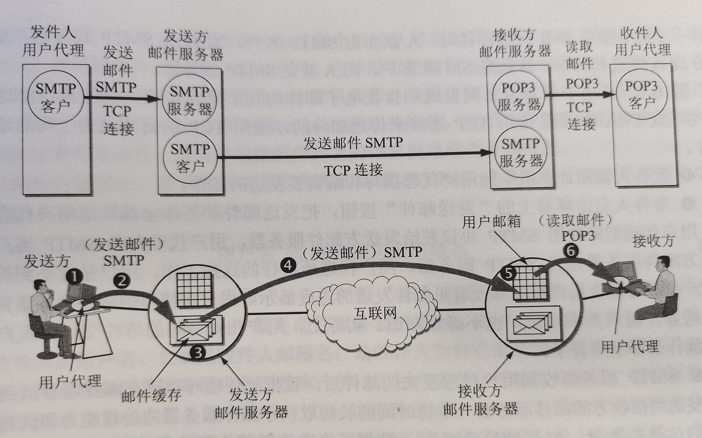

# 电子邮件    

## 1、概述    

电子邮件(e-mail)是互联网上使用很多的一种应用。电子邮件把邮件发送到收件人使用的邮件服务器，并放在收件人邮箱中，收件人还可在自己方便时上网到自己的使用的邮件服务器进行读取。1982年ARPNET的电子邮件问世后，很快就称为最受欢迎的互联网应用。    

电子邮件的两个最重要标准：**简单邮件传送协议SMTP(Simple Mail Transfer Protocol)**和**互联网文本报文格式**。    

- MIME：    

由于互联网SMTP只能传送可打印的7位ASCII码邮件，因此在1993年又提出了**通用互联网邮件扩充MIME(Multipurpose Internet Mail Extenisions)**。MIME在其邮件首部中说明了邮件的数据类型（文本、声音、图像、视频等）。在MIME邮件中可同时传送多种类型的数据。    

### 电子邮件系统的组成    

    

> 一个电子邮件系统应该具有如图三个主要组成构件：用户代理、邮件服务器、邮件发送协议（如SMTP）和邮件读取协议（如POP3）。    

> **用户代理(UserAgent,UA)**就是用户与电子邮件系统的接口，在大多数情况下它就是运行在用户电脑中的一个程序，因此又称为**电子邮件客户端**。UA应该具有**撰写**、**显示**、**处理**、**通信**等功能。    
> 互联网上有很多邮件服务器可供选择。邮件服务器24小时不间断工作并且具有很大容量的邮件信箱，邮件服务器必须能够同时充当服务器和客户端。    
> 邮件服务器按照C/S方式工作，邮件服务器需要使用两种不同的协议。一种协议用于客户代理向邮件服务器发送邮件或在邮件服务器之间发送邮件。如**SMTP协议**。另一种用于用户代理从邮件服务器读取邮件，如**邮局协议POP3**，**SMTP和POP3都是使用TCP进行连接的**。    

### 电子邮件格式    

电子邮件由*信封(envelop)*和*内容(content)*两部分组成，电子邮件传输程序根据信封上的信息来传送邮件。    

TCP/IP规定电子邮件地址的格式：`用户名@邮件服务器域名`    

 
 

## 2、简单邮件传送协议SMTP    

SMTP规定在两个相互通信的SMTP进程之间应该如何交换信息。SMTP使用C/S方式，因此负责发送邮件的SMTP进程就是SMTP客户，负责接收邮件的SMTP进程就是SMTP服务器。    

SMTP有14条命令和21种问答信息，每一种应答信息一般只有一行信息，由一个三位数字的代码开始。    

### 连接建立    

发件人的邮件送到发送方邮件服务器的邮件缓存后，SMTP客户就每隔一段时间对邮件缓存扫描一次。如发现有邮件，就使用SMTP熟知端口号25与接收方邮件服务器的SMTP服务器建立TCP连接。    

建立连接后，接收方SMTP服务器就要发出`202 Service ready`。然后SMTP客户向SMTP服务器发送HELO命令，附上发送方的主机名。SMTP服务器若有能力接收邮件，则回答`250 OK`，表示已准备接收，如果SMTP服务器不可用则回答`421 Service not available`。    

SMTP不使用中间服务器。不管发送方和接收方的邮件服务器有多远，TCP连接总是在发送方和接收方这两个邮件服务器之间直接建立。    

### 邮件传送    

邮件传送从MAIL命令开始。MAIL命令后面由发件人地址。如果SMTP服务器已准备好接收邮件，则回答`250 OK`。否则返回一个代码指出原因，如`451`(处理时错误)、`452`(空间不足)、`500`(命令无法识别)等。    

下面跟着一个或多个RCPT命令，取决于把同一个邮件发送给一个或多个收件人，其格式为`RCPT TO: <收件人地址>`。RCPT是Recipient(收件人)缩写。每发送一个RCPT命令都应当由相应的信息从SMTP服务器返回。    

RCPT命令的作用就是：先弄清接收方系统是否做好了接收邮件的准备，然后才发送邮件，不至于发送了很长的邮件以后才知道地址错误，避免浪费通信资源。    

下面是DATA命令，表示要开始传送邮件内容了。SMTP服务器返回的信息是`305 Start mail input; end with <CRLF><CRLF>`。如果不能接收邮件则返回`421`(服务器不可用)或`500`(命令无法识别)等。    

接着SMTP客户端发送邮件内容。发送完毕后再发送`<CRLF>.<CRLF>`表示邮件内容结束。若邮件收到了，则SMTP服务器返回信息`250 OK`，或者返回差错代码。    

### 连接释放    

邮件发送完毕后，SMTP客户应发送QUIT命令。SMTP服务器返回的信息是`221`(服务关闭)，表示SMTP同意释放TCP连接。邮件传送的全部过程结束。    

### ESMTP  

为了解决SMTP的一些缺点，2008年RFC5321对SMTP进行了扩充，称为Extended SMTP。新增加的功能有：客户端鉴别、服务器接受二进制报文、服务器接受分块传送的大报文、发送前检查报文大小、使用安全传输TLS、使用国际化地址等。    

 
 

## 3、电子邮件的信息格式    

一个电子邮件分为信封和内容两大部分。RFC5322文档中只规定了邮件内容中*首部(header)*格式，而对*主体(body)*格式不做限制。    

- 首部Header：  

邮件内容首部包括一些关键字。最重要的是`To`和`Subject`。    

“**To:**”后面填入一个或多个收件人的电子邮件地址。    
“***Subject:**”是邮件的主题。它反映了邮件的主要内容。    
“**Cc:**”抄送。    
“**Bcc:**”暗送。  
“**From:**”发件人电子邮件地址。  
“**Date:**”发信日期。  
“**Reply-To:**”即对方回信所用地址。    

 
 

## 4、邮件读取协议POP3和IMAP    

常用的邮件读取协议有两个：*邮局协议3(POP3)*和*网际报文存取协议IMAP(Internet Message Access Protocol)*。    

- 邮局协议POP3：    

POP3是一个非常简单但功能有限的邮件读取协议，公布于1984年。POP3使用C/S工作方式。在接收邮件的用户计算机中的用户代理必须运行POP3客户程序，而在收件人所连接的ISP的邮件服务器中则必须运行POP3服务器程序。    

POP3的一个特点就是只要用户从POP3服务器读取了邮件，POP3服务器就把该右键删除。这在某些情况下就不够方便，所以POP3进行了一些功能扩充，其中包括让用户能够事先设置邮件读取后仍然在POP3服务器存放的时间。    

- IMAP4：  

另一个读取邮件的协议是网际报文存取协议IMAP，它比POP3复杂得多。IMAP也按C/S方式工作，但是和POP3有很大差别。    

在使用IMAP时，在用户的计算机上运行IMAP客户程序，然后与接收方的邮件服务器上的IMAP服务器程序建立TCP连接。用户在自己的计算机上就可以操纵邮件服务器的邮箱，就像在本地操纵一样，因此IMAP是一个**联机协议**。当用户计算机上的客户端打开IMAP服务器的邮箱时，就可以看到邮件的首部。需要打开某个某个邮件则该邮件才会传到用户计算机上。在用户未发出删除命令前，IMAP服务器邮箱中的邮件一直保存着。    

IMAP最大的好处就是用户可以在不同的地方使用不同的计算机随时上网阅读和处理自己在邮件服务器中的邮件。缺点是如果没有复制邮件到自己计算机上，则需要上网才能查看邮件。      

 
 

## 5、基于万维网的电子邮件    

20世纪90年代中期，Hotmail推出了基于万维网的电子邮件(Webmail)。今天几乎所有的著名网站以及机构都提供了万维网电子邮件。例如Gmail、Hotmail、Yahoo!Mail等。    

万维网电子邮件的好处就是：不管在什么地方，只要能找到能上网的计算机，都可以非常方便地收发电子邮件，而不需要在计算机中安装任何软件。    

 
 

## 6、通用互联网邮件扩充MIME    

### Ⅰ、概述    

SMTP有很多缺点：  
1. 不能传送可执行文件或其他二进制文件。    
2. 只能传送ASCII文本。许多其他国家的文字无法传送。    
3. SMTP服务器会拒绝超过一定长度的邮件。    
4. 某些SMTP的实现并没有完全按照SMTP的互联网标准。    

在这种情况下就提出了*通用互联网邮件扩充MIME*。MIME继续使用原来的邮件格式，可在现有的电子邮件程序和协议下传送，但增加了邮件主体的结构，并定义了非ASCII码的编码规则。    

MIME主要包括三个部分：  
1. 5个新的邮件首部字段。    
2. 定义了许多邮件内容的格式，对于多媒体电子邮件的表示方法进行了标准化。    
3. 定义了传送编码，可对任何内容格式进行转换。    

MIME新增的邮件首部：    
1. MIME-Version：标志MIME的版本。    
2. Content-Description：可读字符串，说明该邮件主体是否是图像、音频、或视频。    
3. Content-Id：邮件的唯一标识符。    
4. Content-Transfer-Encoding：在传送时邮件的主体如何编码。  
5. Content-Type：说明邮件主体的数据类型和子类型。    

### Ⅱ、内容传送编码    

1. **7位ASCII编码**。MIME对这种邮件主体不进行任何转换。    
2. **quoted-printable**。这种编码方法适用于所传送的数据中只有少量的非ASCII码。需要用等号对不可打印的ASCII码和非ASCII码进行转换。    
3. **base64编码**。对于任意的二进制文件，可用base64编码。Base64把每6位划为一个组进行编码。    

### Ⅲ、内容类型    

MIME标准规定`Content-Type`说明必须含有两个标识符，即内容类型和子类型，中间用`/`分开。    

|内容类型|子类型举例|说明|
|-|-|-|
|text文本|plain,html,xml,css|不同格式的文本|
|image图像|gif,jpeg,tiff|不同格式的图像|
|audio音频||basic,mpeg,mp4|可听见的声音|
|video视频|mpeg,mp4,quicktime|不同格式的影片|
|model模型|vrml|3D模型|
|application应用|octet-stream,pdf,javascript,zip|不同应用程序产生的数据|
|message报文|http,rfc822|封装的报文|
|multipart多部分|mixed,alternative,parallel,digest|多种类型的组合|    

> mixed子类型允许大哥报文含有多个互相独立的子报文。  
> alternative子类型允许单个报文含有同一数据的多种表示。  
> parallel子类型允许单个报文含有可同时显示的各个子部分。（例如图像和声音子部分必须一起播放）    
> digest子类型允许单个报文含有一组其他报文。    

（END）  