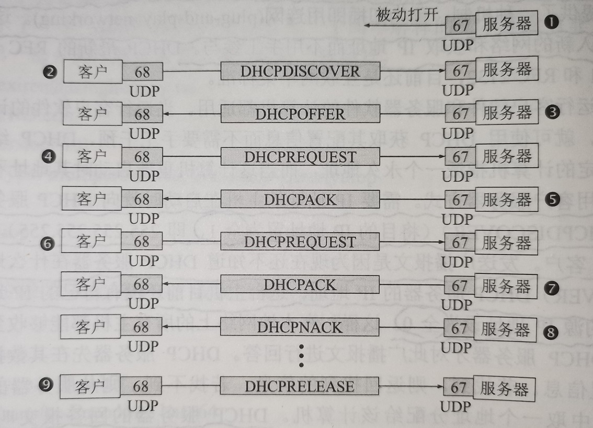

# 动态主机配置协议DHCP    

### 概述    

> 为了把协议软件做出通用的和便于移植的，协议软件的编写者不会把所有细节都固定在源码中。相反，他们把协议软件参数化。这就使得很多台计算机上有可能使用同一个经过编译的二进制代码。一台计算机和另一台计算机的许多区别都可以通过一些不同的参数来体现。在协议软件运行之前，必须先给参数赋值。（CRE：类似于游戏编程中的数据驱动？）      

- 在协议软件中给参数赋值的动作叫做**协议配置**。一个协议软件在使用之前必须是已正确配置的。具体的配置信息有哪些取决于协议栈。例如连接到互联网的计算机的协议软件需要配置的项目包括：  
1. IP地址。  
2. 子网掩码。  
3. 默认路由器的IP地址。    
4. 域名服务器的IP地址。    

- 自动配置协议：    

用人工进行协议配置很不方便，而且容易出错。因此应该采用自动协议配置的方法。互联网现在广泛使用的是**动态主机配置协议DHCP**，它提供了一种机制，称为**即插即用连网(plug-adn-play networking)**。这种机制允许一台计算机加入新的网络和获取IP地址而不用手工参与。    

- 动态IP和静态IP：  

DHCP对允许客户软件和服务器软件的计算机都适用。当运行客户软件的计算机移至一个新的网络时，就可使用DHCP获取其配置信息而不需要手工干预。DHCP给运行服务器软件而位置固定的计算机指派一个永久地址，而当这台计算机重新启动时其地址不变。    

### DHCP工作方式    

DHCP使用C/S工作方式。需要IP地址的主机在启动时就向DHCP服务器广播发送**发现报文(DHCPDISCOVER)**（将目的IP地址置为`255.255.255.255`），这时该主机就成为DHCP客户。发送广播报文是因为现在还不知道DHCP服务器在什么地方，因此要发现DHCP服务器的IP地址。    

这台主机目前还没有自己的IP地址，因此它将IP数据报的源IP地址置为`0.0.0.0`。这样，在本地网络上所有主机都能收到这个广播报文，但只有DHCP服务器才对此广播报文进行回答。    

DHCP服务器先在其数据库中查找该计算机的配置信息。若找到则返回找到的信息。若找不到则从服务器的IP地址池中取一个地址分配给该计算机。DHCP服务器的回答报文叫做**提供报文(DHCPOFFER)**，表示提供了IP地址等配置信息。      

### 关于中继代理    

如果每一个网络上都设置一个DHCP服务器，会使DHCP服务器数量太多。因此现在是每一个网络至少有一个**DHCP中继代理(relay agent)**，通常是一台路由器，它配置了DHCP服务器的IP地址信息。当DHCP中继代理收到主机A以广播形式发送的发现报文后，就以单播方式向DHCP服务器转发此报文，并等待其回答。收到DHCP服务器回答的提供报文后，中继代理再把提供报文发回给主机A。    

### 关于临时地址    

DHCP服务器分配给DHCP客户的IP地址是临时的，因此DHCP客户只能在一段有限的时间内使用这个分配到的IP地址。DHCP协议称这段时间为**租用期(lease period)**，但是并没有规定租用期应取为多长时间，这个数值由DHCP服务器自己决定。DHCP客户也可在自己发送的报文中提出对租用期的要求。      

### 工作过程图示    

  

> DHCP服务器和DHCP客户分别使用UDP的`67`端口和`68`端口。      
> 被选择的DHCP服务器发送确认报文`DHCPACK`。从这时起DHCP服客户就可以使用这个IP地址了，这叫做**已绑定状态**。    
> 租用期过半，DHCP发送请求报文`DHCPREQUEST`要求更新租用期。DHCP服务器若同意就发回确认报文`DHCPACK`，客户端重设计时器。若不同意则发回否认报文`DHCPNACK`。这时DHCP客户必须立刻停止使用原来的IP地址。    
> DHCP客户可以随时提前终止服务器提供的租用期，只需要向DHCP服务器发送释放报文`DHCPRELEASE`。    

(END)  