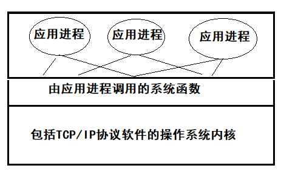
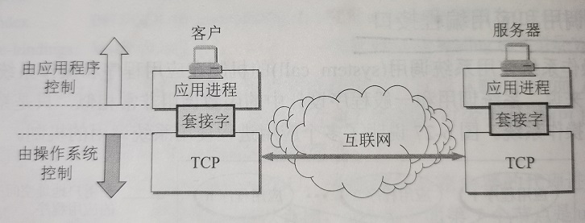
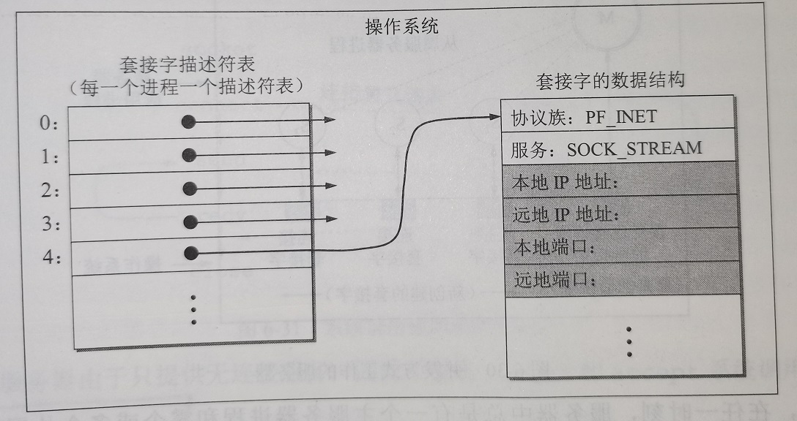
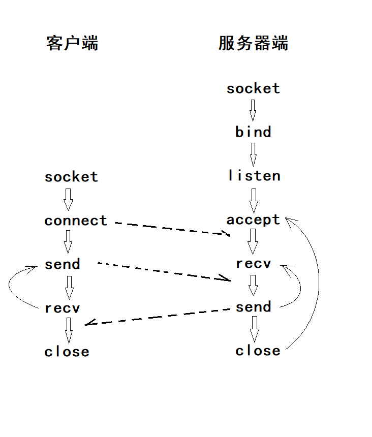
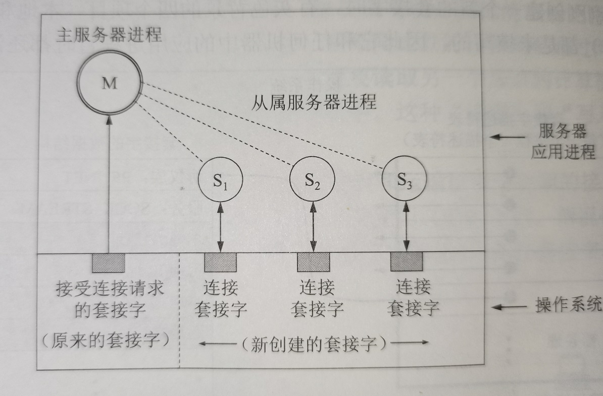

# 应用进程跨网络通信    

> 如果一些特定的应用进程又不能直接使用已经标准化的互联网应用协议，那么就可以使用**系统调用**和**应用程序编程接口**。    

## 1、系统调用和应用编程接口    

大多数操作系统使用*系统调用(system call)*的机制在应用程序和操作系统之间传递控制权。对程序员来说，系统调用和一般程序设计中的函数调用非常相似，只是系统调用是将控制权传递给了操作系统。    

    

当某个应用进程启动系统调用时，控制权就从应用进程传递给了系统调用接口。此接口再把控制权传递给计算机操作系统。操作系统把这个调用转给某个内部过程，并执行所请求的操作。内部过程一旦执行完毕，控制权就又通过系统调用接口返回给应用进程。    

这种系统调用接口又称为**应用程序编程接口(API)**。API从程序设计的角度定义了许多标准的系统调用函数。应用进程只需要使用标准的系统调用函数就可以得到操作系统的服务。因此从程序设计角度看，可以把API看成**应用程序和操作系统之间的接口**。    

### CRE：几种著名的TCP/IP应用编程接口    

现在TCP/IP协议软件已经驻留在操作系统中。由于TCP/IP协议族被设计成能运行在多种操作系统环境中，因此TCP/IP标准没有规定应用程序与TCP/IP协议软件如何接口的细节，而是允许系统设计者能够选择有关API的实现细节。目前只有几种可供应用程序使用TCP/IP的API。最著名的就是加利福利亚大学伯克利分校为BerkeleyUNIX操作系统定义的**套接字接口API(Socket API)**，微软在其操作系统中采用了套接字API，形成了一个稍有不同的API称为**Windows Socket**。AT&T为其UNIX系统V定义了一种API简写为**TLI(Transprot Layer Interface)**。    

### CRE：套接字Socket      

在讨论网络编程时常常把套接字作为应用程序和运输层协议之间的接口。如图所示。    

    

图：套接字成为应用进程与运输层协议的接口
  

> 套接字以上的进程是受应用程序控制的，而在套接字以下的运输层协议则是收计算机操作系统控制。因此只要应用程序使用TCP/IP进行通信，他就必须通过套接字与操作系统交互。    
> 应用程序开发者对套接字以上的应用进程具有完全控制，但对套接字以下的运输层却只有而后年少的控制。    

### CRE：套接字描述符    

    

图：调用socket创建套接字
  

当应用进程(客户或服务器)需要使用网络进行通信时，必须首先发出**socket系统调用**，请求操作系统为其创建一个“套接字”。这个调用实际效果是请求操作系统把网络通信所需的一些系统资源（例如存储空间、CPU时间、带宽等）分配给该应用进程。    

操作系统为这些资源的总和用一个叫做**套接字描述符(socket descriptor)**的整数来表示，然后把这个套接字描述符返回给应用进程。此后，应用进程所进行的网络操作都必须使用这个套接字描述符。所以几乎所有的网络系统调用都把这个套接字描述符作为套接字的许多参数中的第一个参数。    

在处理系统调用的时候，通过套接字描述符，操作系统就可以识别出应该使用哪些资源来完成应用进程所请求的服务。通信完毕后，应用进程通过一个关闭套接字的close系统调用通知操作系统回收与该套接字描述符相关的所有资源。    

由此可见，套接字是应用进程为了获得网络通信服务而与操作系统交互时使用的一种机制。    

 
 

## 2、几种常用的系统调用（以使用TCP服务为例）    

  

> UDP服务器由于只提供无连接服务，因此不使用`accept`和`listen`系统调用。      

### Ⅰ、建立连接阶段    

- 服务器：  

当套接字被创建以后，它的端口号与IP地址都是空的，因此应用进程要调用`bind`（绑定）来指明套接字的本地地址。在服务器端调用`bind`时就是把熟知端口号和本地IP地址填到已创建的套接字中。    

（在客户端也可以不调用`bind`，这时由操作系统内核自动分配一个动态端口号，通信结束后收回。）    

在服务器调用`bind`后，还必须`listen`（收听）把套接字设置为**被动**方式，以便随时接受客户的服务请求。(UDP服务器由于只提供无连接服务，不使用`listen`系统调用)    

服务器紧接着调用`accept`，以便把远程客户进程发来的连接请求提取出来。系统调用`accept`的一个变量就是要指明是从哪一个套接字发起的连接。    

调用`accept`要完成的动作较多，这是因为一个服务器必须能够同时处理多个连接。这样的服务器常称为**并发(concurrent)**工作服务器，并发有多种实现方法，下图是一种实现方法。    

  

图：并发方式工作的服务器
  

> 主服务器进程一调用`accept`，就为每一个新的连接请求创建一个新的套接字，并把这个新创建的套接字的标识符返回发起客户。  

> 与此同时，主服务器进程还要创建一个从属服务器进程来处理新建立的连接。这样从属服务器进程用这个新创建的套接字和客户建立连接，而主服务器进程用原来的套接字重新调用`accept`，继续接受下一个连接请求。    

> 通信结束后，从属服务器关闭新创建的套接字，同时从属服务器也撤销。总之，服务器中总是有一个主服务器进程和0~N个从属服务器进程。    

> CRE：从属进程可用多线程代替？        

- 客户：  

使用TCP协议的客户调用socket创建套接字后，客户进程就调用`connect`，以便和远程服务器建立连接（主动打开，相当于客户发出的连接请求）。在`connect`系统调用中，客户必须指明远程主机IP和端口号。    

### Ⅱ、数据传送阶段    

客户和服务器都在TCP连接上使用`send`系统调用传送数据，使用`recv`系统调用接收数据。  

服务器使用`recv`接受客户用`send`发送的请求。客户在发送完请求后用`recv`接收回答。    

调用`send`需要三个变量：数据要发往的套接字的描述符、要发送的数据的地址、数据长度。（操作系统内核有缓存）    

调用`recv`也要三个变量：要使用的套接字的描述符、缓存地址、缓存空间长度。    

### Ⅲ、连接释放阶段    

一旦客户或服务器结束使用套接字，就把套接字撤销。这时调用`close`释放连接和撤销套接字。    

（END）    