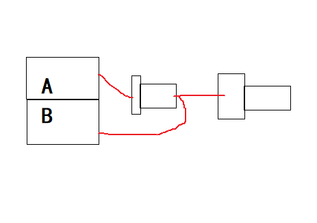

# 机轮稳定性    

1. traction调小，suspension调小，dumper设置为0。    
2. 车轮重量、车辆连接的零件重量调大。  

# 转轴稳定性    

隔离法：    

  

> 过渡零件两端分别连A、B比都连同一个好，因为SP不会自动删除连接点。    
> 过渡零件用转轴比活塞好，更加稳定。    
> 可以用多个过渡零件强化。    

（END）  