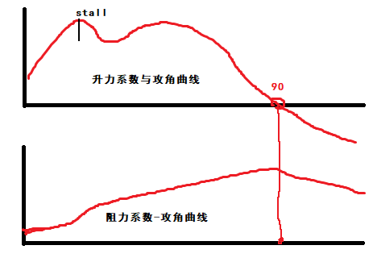
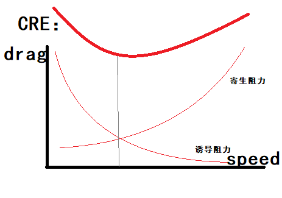

# 阻力    

CRE:升力/阻力系数曲线示例（对称翼型）：  
  

CRE:平飞阻力曲线(即恒定阻力)  
  

> CRE：诱导阻力等于寄生阻力时，总阻力最小，升阻比最大。    

## 诱导阻力    

CRE:相同升力下，速度减小、攻角变大，诱导阻力增大。    

CRE:诱导阻力不是按微观机理定义的，因此不能直接计算。    

## 寄生阻力    

形状阻力：与速度平方正比。  
表面摩擦力：与速度平方大约正比。  
干扰阻力：不同部位在流场中互相影响。    

## 激波阻力    

高速物体的波阻很大。    

 
 
 
 

# 螺旋桨推力    

$T_{推力} = C_t ρn^2D^4$    

> ρ：空气密度。  
> n：转速  
> D^4：尺寸参数(直径、螺旋桨等参数)    

 
 
 
 

# 襟翼    

- 简单襟翼    

> CRE:简单襟翼与副翼的原理相似，升力和阻力会同时增大，但一般情况下阻力增大多谢，升阻比下降。    
> CRE:会使临界迎角降低（相当于增加了翼型攻角）。    
> CRE:增升效果不好。    

 
 
 
 

# 展弦比    

> 大展弦比机翼受到的诱导阻力小，适合低阻。    
> 小展弦比机翼的失速迎角更大。    
> CRE：尾翼使用小展弦比，则会远后于主翼失速。一般来说，垂尾展弦比 < 平尾展弦比 < 主翼展弦比。    

（END）    
